近两个月高强度使用[Claude Code](https://zhida.zhihu.com/search?content_id=271738794\&content_type=Article\&match_order=1\&q=Claude+Code\&zhida_source=entity)，在体验了国内各大厂的低价首购 Coding Plan 后，最终还是回归到了原生的[Claude Opus](https://zhida.zhihu.com/search?content_id=271738794\&content_type=Article\&match_order=1\&q=Claude+Opus\&zhida_source=entity)模型——毕竟在代码能力上，满血 Opus 依然是第一梯队。

由于 Anthropic 对地域及 IP 的风控强度远超 OpenAI，国内开发者必须构建一套从账号权重到网络链路的完整合规环境。

## 阅前须知

> 本文面向的读者。如果你追求开箱即用的体验，建议直接选择国内 Coding Plan 或中转站商家。

## 前置准备

在执行部署前，请确认以下环境就位：

* **Runtime:** Node.js 18.0.0 或更高版本。
* **Email:** 纯净海外邮箱（推荐 Gmail 或 Proton，严禁使用国内厂商邮箱）。

## 搞定静态住宅IP

普通的机场节点通常是机房 IP，成千上万人在用，早就被 Anthropic 拉黑了。我们要用的是**静态住宅 IP&#x20;**。静态住宅 IP 给你的是“私人住宅宽带 IP”，是真实家庭用户的网络，只分配给你一个人使用，固定不变。

对 Claude 来说，这种 IP 就像是一个真实住在美国的普通用户在上网，风险极低。

我使用的是EqualVPN，支持美国节点，IP 质量高，支持支付宝付款。

[https://www.equaldcdn.com/?ref=7afbd4d73a
](https://www.equaldcdn.com/?ref=7afbd4d73a)通过邀请链接注册，可以享受八折优惠。

## 购买步骤：

1、打开注册链接，填写邮箱和、密码、验证码完成注册

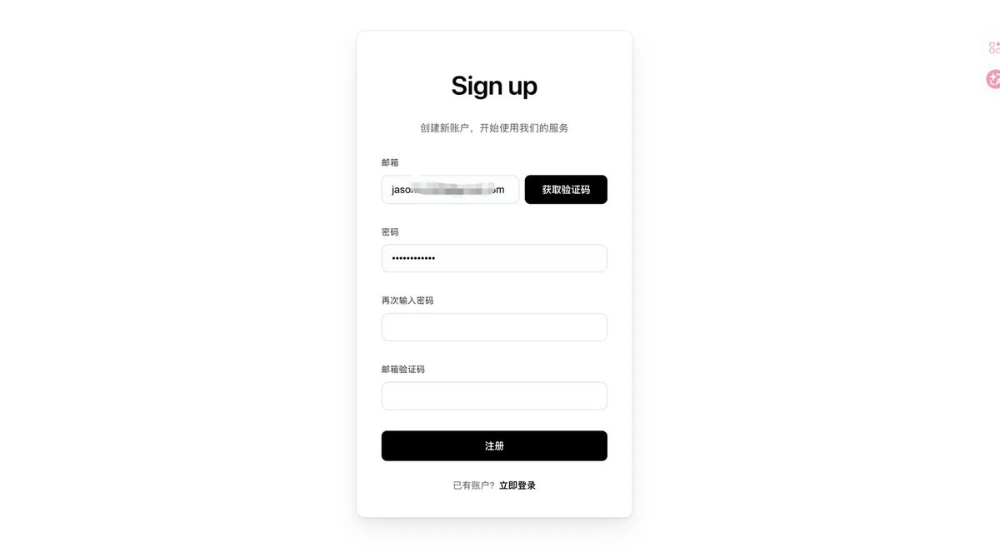

2、登录后，在 Dashboard 页面点击「购买套餐」

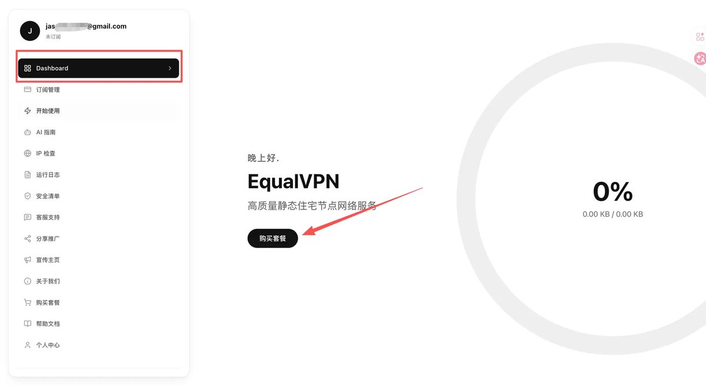

3、选择套餐，这两个都行

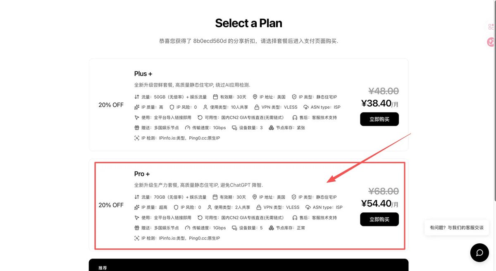

4、用支付宝完成付款

5、购买成功后，进入「开始使用」页面，点击“开始配置”按钮，然后按照页面的提示进行操作

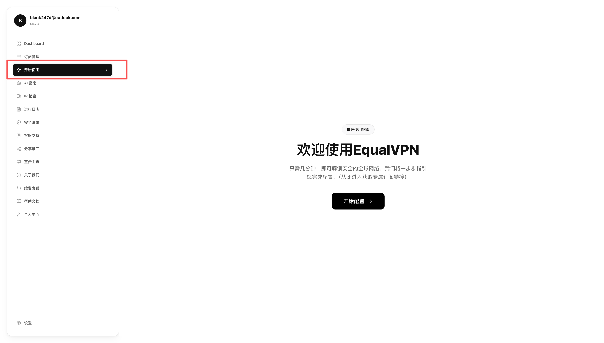

## 安装并配置 AdsPower 指纹浏览器

注册地址：👉https://www.adspower.net/share/launch

AdsPower 免费版可以创建最多 2 个浏览器环境，对于个人用户来说也够用了。

## 新建一个专属 Claude 的浏览器环境

3.1 登录后，点击左上角的「新建浏览器」按钮。

3.2 基础信息设置：

* 名称：填写 Claude（方便识别）
* 浏览器版本：点击下拉框，选择最新的 Chrome 版本（比如 Chrome 133）
* 操作系统：选择 Windows 11 或 macOS，随便选一个
* 其余的按我的图中标注来就行

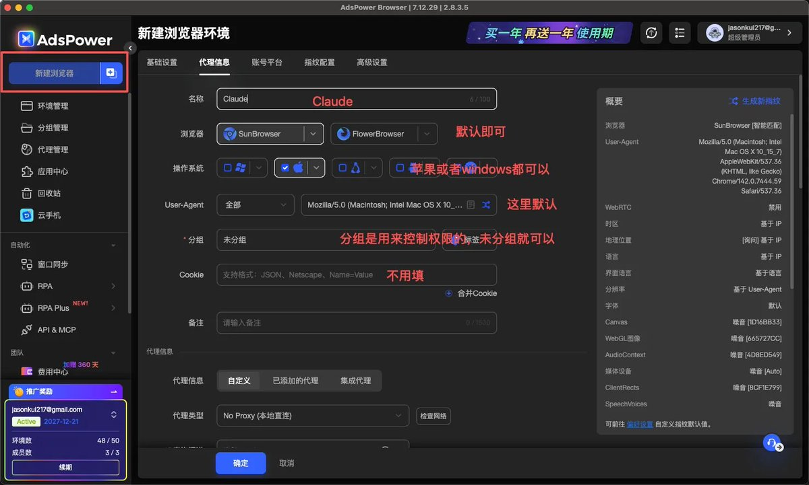

3.3 代理信息设置（关键步骤）：

点击顶部的「代理信息」标签，这里有两种填写方式：

方案 1：使用系统代理（最简单）

代理类型：选择本地直连

IP 查询渠道：这个默认即可

这个方式也就是使用了指纹浏览器的环境，但是节点还是走的本地的节点配置，这个和你本地使用一个新的浏览器是一个道理，只不过指纹浏览器会保持各方面信息的一直，多了一层伪装。

方案 2：手动填写代理

可以手动设置代理端口：

1. 在 Clash 中查看本地代理端口（一般是 127.0.0.1:7890 或 7897）。
2. 在指纹浏览器新建环境时： 代理类型：HTTP 或 SOCKS5 IP:127.0.0.1 端口：Clash 本地端口：7897
3. 保存并启动环境即可。

填写完成后，点击「检查代理」，如果显示「连接测试成功」并且国家显示为「US（美国）」，就说明配置正确了。

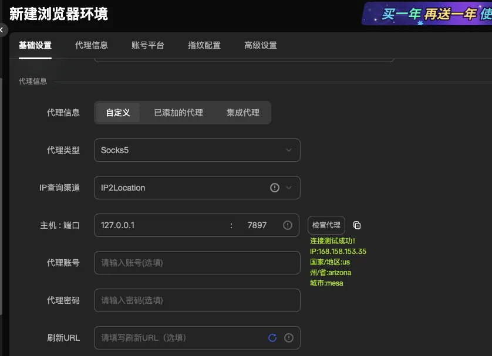

⚠️ 如果显示连接失败，检查一下代理信息是否填写正确，或者联系客服确认代理是否正常。

其他的信息全部默认就行，最后点击「确定」，保存这个浏览器环境。

🔒重要原则：以后使用 Claude，永远只在这个指纹浏览器里操作。不要用你本机的 Chrome、Safari 或者 Edge 登录 Claude，哪怕只是看一眼也不行。

## 订阅Claude推荐方案：通过 App Store 订阅

这是目前公认比较稳定的订阅方式之一。通过苹果的 App Store 支付，Claude 会认为你是一个正规的 iOS 用户，账号权重大幅提升。

## 注册美区 Apple ID

注册美区 Apple ID 和购买 Apple 礼品卡都需要一个美国地址，在这里使用神奇的美国地址生成器来获取。

注意美国的洲分为免税州和非免税州，如果你的 ChatGPT PLUS 订阅价格超过了 20 美元，大概率是因为填写了非免税州的地址，推荐蒙大拿州，景色秀丽而且免税。

[蒙大拿州地址生成器](https://www.meiguodizhi.com/usa-address/montana)

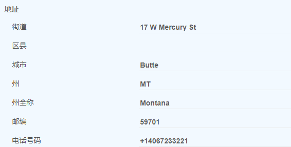

其实要用到的只有这一小部分，保存好，每次购买礼品卡都要用。

## 注册 ID

然后来到[苹果官网](https://appleid.apple.com/account)注册 Apple ID，建议全程使用美国节点科学上网。

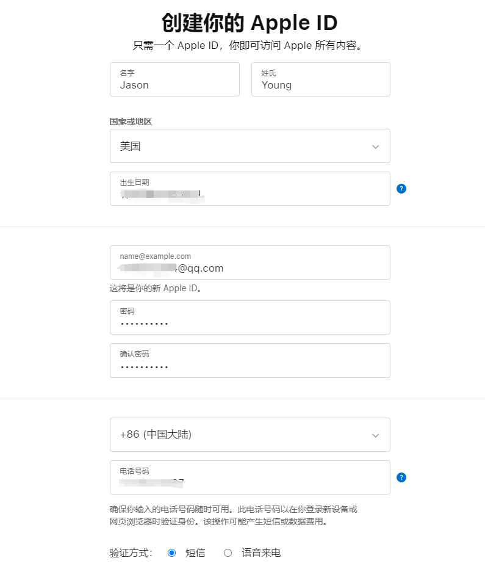

地址选美国，邮箱和手机都可以使用大陆的，填完邮箱和手机的验证码后进入账户管理界面。

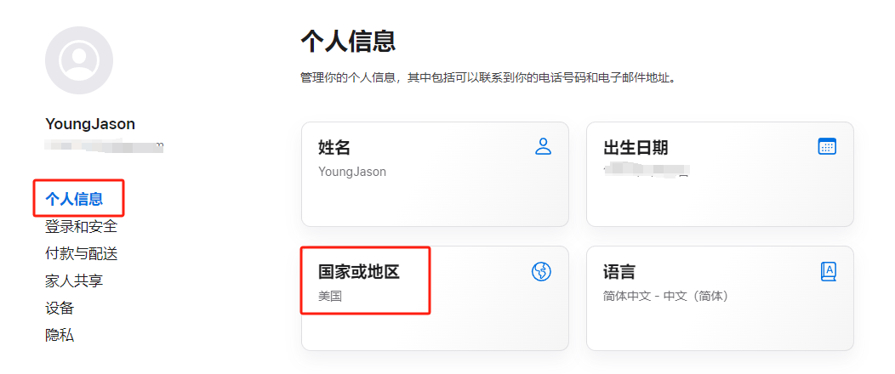

新注册的 ID 想在 Appstore 进行支付，需要先填写一个付款方式和账单地址，点击`个人信息`--`国家或地区`填写。

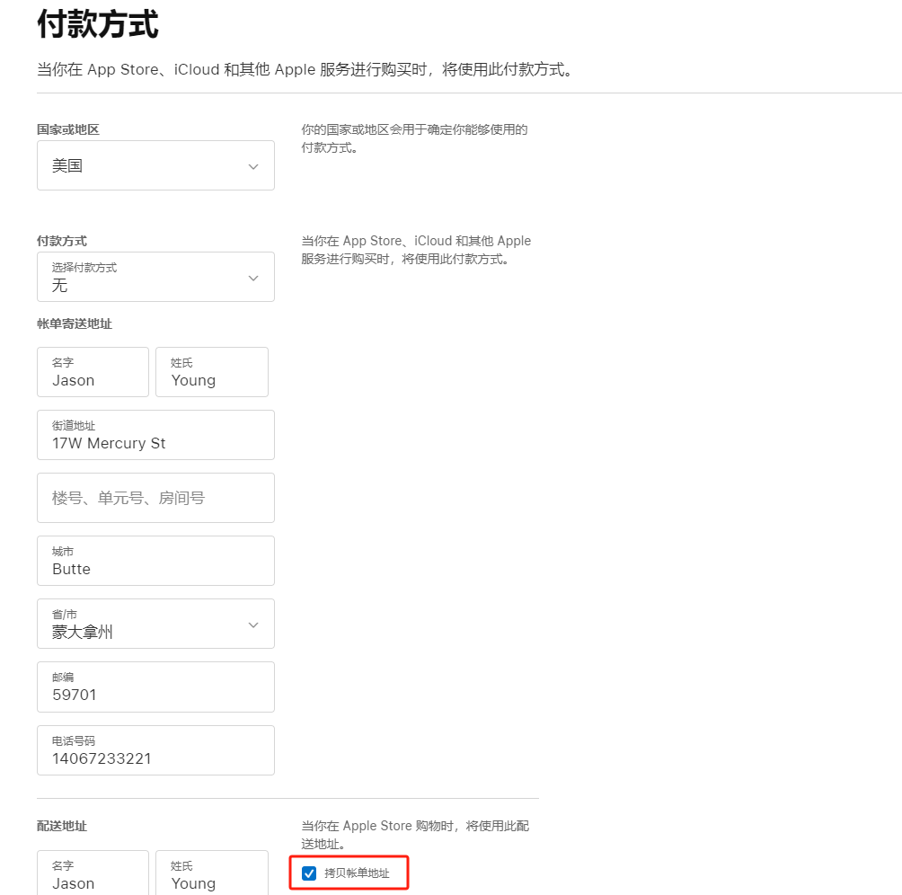

国家选美国，付款方式选`无`，因为我们只通过礼品卡充值，所以不需要绑定支付方式，下面填入我们获取的美国地址和联系方式，如果提示电话号码无效，请去[美国地址生成器](https://www.meiguodizhi.com/usa-address/montana)多刷新几个试试，因为这个号码只是账单地址所以不需要真实有效。保存信息后这个 Apple ID 就可以在 App Store 正常进行支付购买了。

## 购买礼品卡

第一步，前往[苹果官网](https://www.apple.com/shop/buy-giftcard/giftcard)购买礼品卡。

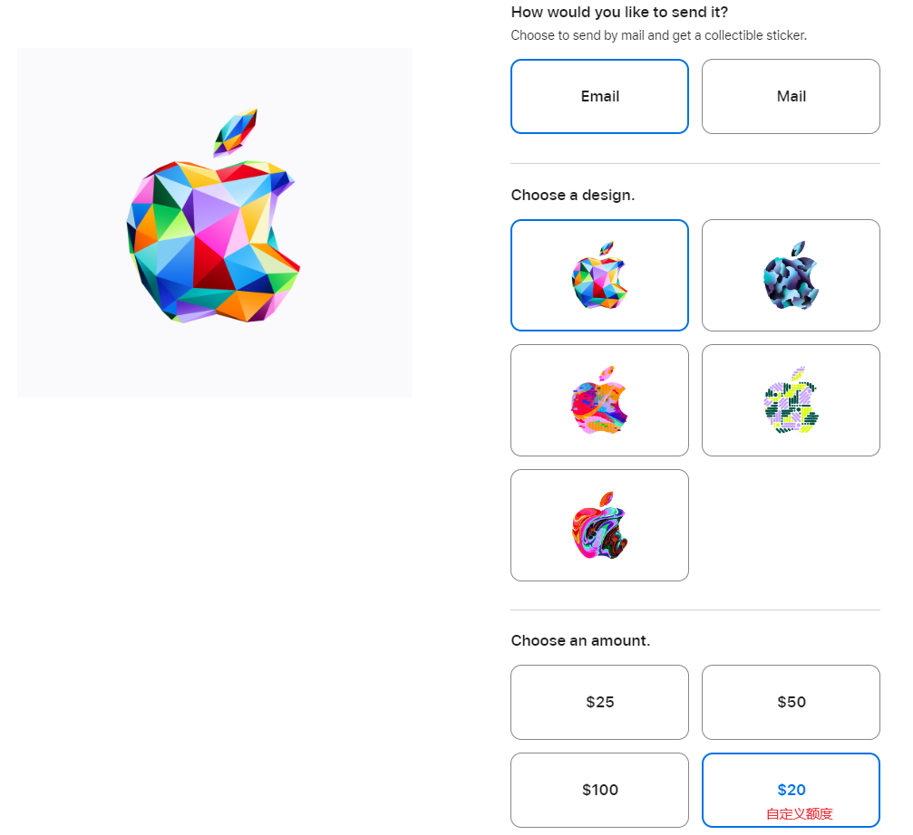

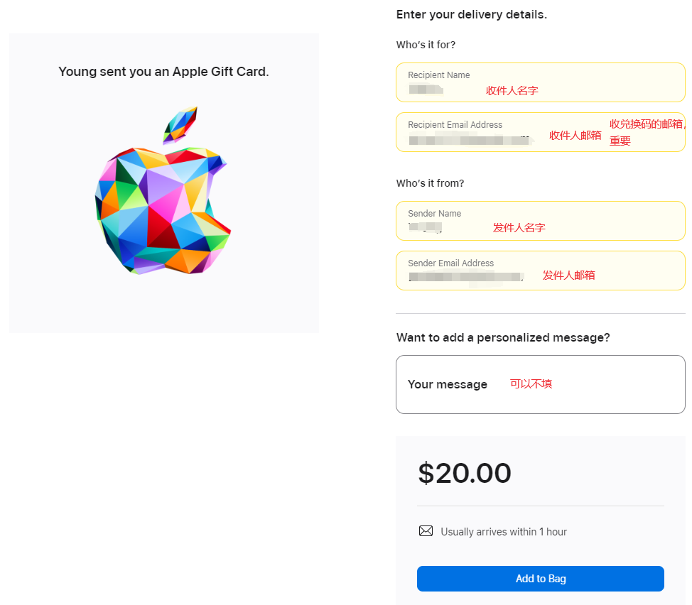

邮寄方式选择 Email，面额选择右下角，填入 20（或者 19.99，IOS 端订阅可以节省\$0.01）,然后是收件人的名字和邮箱、发件人的名字和邮箱，一定要使用自己能登录的邮箱地址，然后点击 Add to Bag。

***

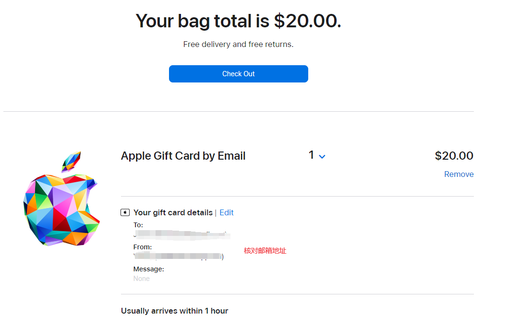

检查邮箱地址无误后 Check Out，下一步因为不使用 Apple Card 支付所以直接点击 Guest 访问。

***

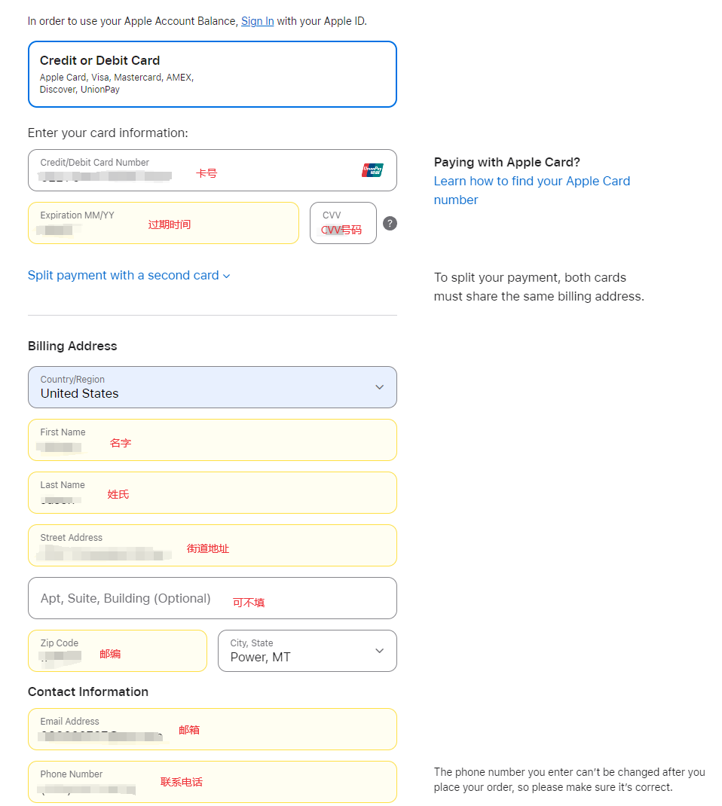

重头戏来了，选择 Credit or Debit Card 支付，填入银联账户的卡号、过期时间和 CVV 码。下面地址栏填入之前注册的美国地址和联系方式，再次强调一定要填免税州的地址，不然会被收税。

***

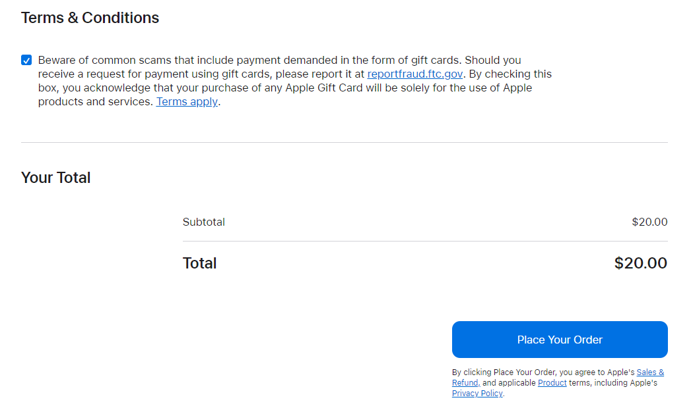

勾选同意后下订单，在下一个页面可以看到订单号，点击进入后可以查看订单进度。

***

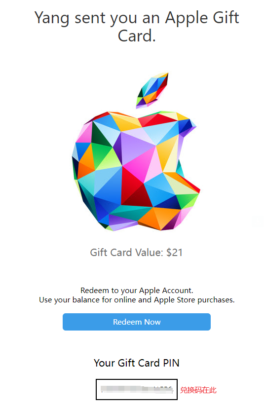

一小时内，收件人邮箱内就能收到邮件，框里面就是兑换码，我们把它复制到手机上。

***

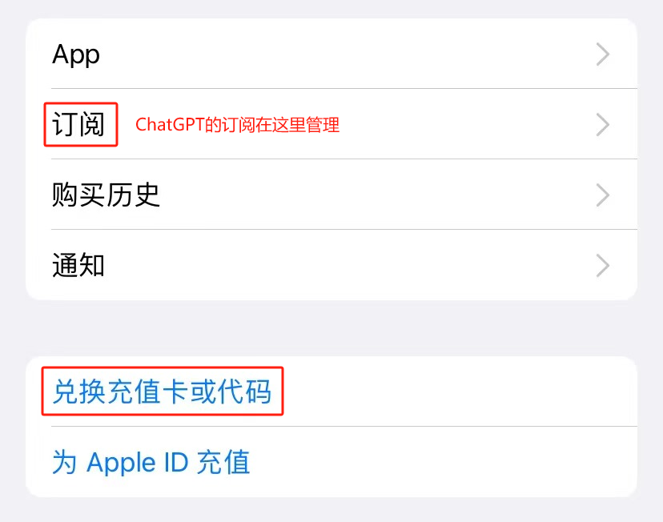

在**AppStore**里面登录美区账号（注意一定**不要**在系统设置里登录），点击右上角头像，选择**兑换充值卡或代码**，将兑换码复制进去充值，成功后可以在账户界面看到余额。

***

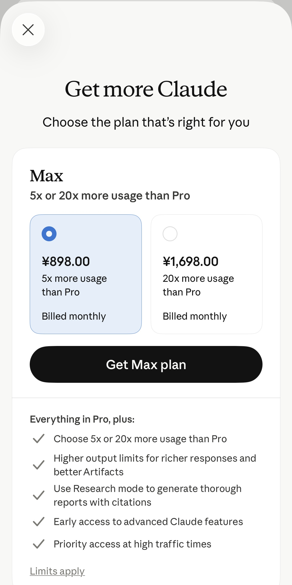

最后打开 Claude app，点击订阅，输入 Apple ID 密码就能成功订阅。取消订阅在 Appstore 的**订阅**里操作，Claude 同理。

## 日常使用的注意事项

账号注册好了，日常使用也要注意几点，才能长期保持稳定：

✅ 应该做的：

* 每次使用 Claude，都在 AdsPower 指纹浏览器里打开
* 保持使用同一个静态 IP，不要随意切换
* 有条件的话，在手机 Claude App 上也保持登录（增加“真实用户”的账号权重），手机端也绑定一个住宅 IP
* 日常像普通用户一样使用，聊天、写作、编程都可以

❌ 不应该做的：

* 不要在本机浏览器登录 Claude
* 不要频繁切换 IP 或节点
* 不要在手机和电脑同时登录，除非确认两边 IP 完全一致
* 不要尝试让 Claude 生成违规内容（这是最直接的封号原因）
* 不要使用低质量虚拟卡订阅

💡一个提升账号权重的小技巧：在手机 Claude App 上保持登录，偶尔日常聊聊天，就像用 ChatGPT 一样。来自一线运营者的经验：有手机 App 长期登录记录的账号，即使遇到高负载使用，被封的概率也极低。
