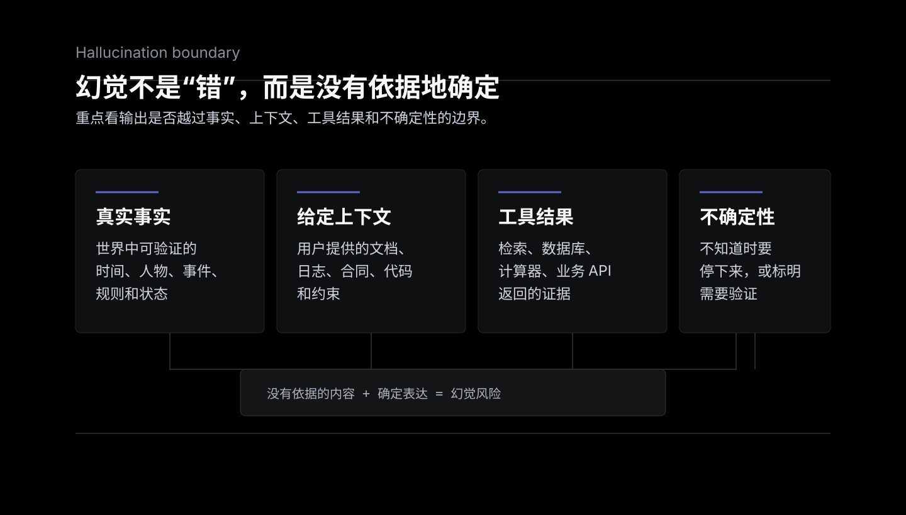
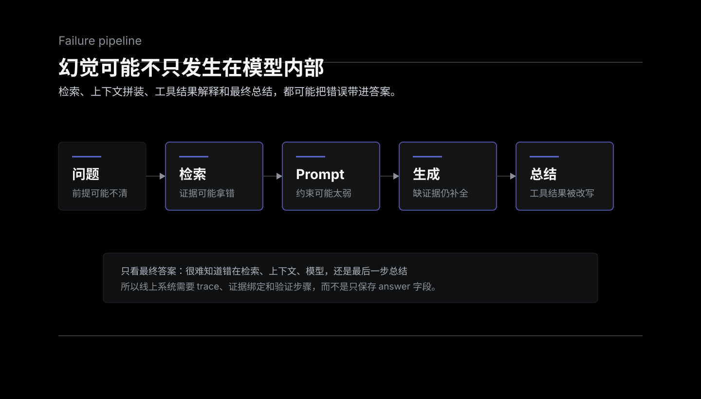
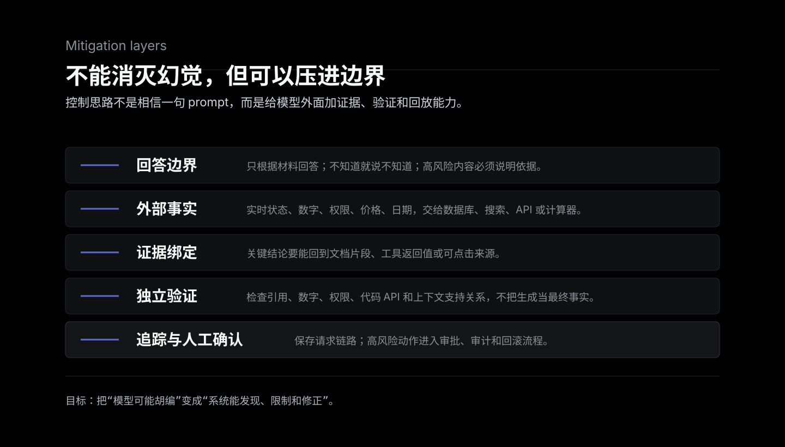

模型幻觉不是模型“看见了不存在的东西”。这个词真正有用的地方，是提醒我们：模型可能生成一段语气自然、结构完整、看起来很可信，但其实没有可靠依据的内容。

更工程化一点说，模型幻觉是指模型输出和事实、输入上下文、工具结果或系统约束不一致，而且这种不一致没有被模型明确标成不确定。它危险的地方不只是“错”，而是“错得像真的”。



## 一个可操作的定义

讨论模型幻觉，最好不要只停在“AI 胡说八道”这个层面。它至少有三种常见不一致：

- 和真实世界不一致：编造一个不存在的论文、公司、人物经历、法律条款或 API。
- 和给定上下文不一致：文档里没有写，模型却说“根据文档可知”；文档明明写 A，模型总结成 B。
- 和工具结果不一致：检索、数据库或计算器返回了一个结果，模型在最终回答里改写成另一个结果。

不是所有错误都应该叫幻觉。比如用户给了错误前提，模型照着复述，问题首先在输入。再比如模型因为知识过期答错了，这可以算事实错误，但如果它没有声称自己很确定，风险性质会不一样。

更实用的判断标准是：

```text
模型有没有把没有依据的内容，包装成确定答案？
```

如果答案是“有”，就应该把它当成幻觉风险处理。

## 为什么模型会幻觉

大语言模型的核心能力是根据上下文生成最可能的下一个 token。它不是数据库，也不是事实引擎。参数里确实存了很多知识，但这些知识不是以“可查询、可校验、可追溯”的方式保存的。

所以模型在回答问题时，经常是在做几件事的混合：

- 从训练中学到的模式里补全一个看起来合理的答案。
- 根据上下文推断用户想要什么格式。
- 在缺少证据时继续生成，而不是自然停止。
- 用非常流畅的语言把不确定内容包装完整。

这不是模型故意撒谎，而是生成式模型的工作方式决定了它擅长“补全”。当问题、上下文、工具结果和约束都足够清楚时，这种补全很有用；当证据不足时，它就可能变成编造。



工程系统里还会放大这个问题。比如 RAG 系统不是接了检索就自动可靠：检索可能拿错文档，文档可能过期，prompt 可能没有强制模型引用证据，模型也可能忽略了正确上下文。工具调用也一样，工具返回对了，不代表最终自然语言总结一定对。

## 常见的幻觉类型

最直观的是事实幻觉。比如模型说某个人在某年获得某个奖项，或者某家公司发布过某个产品，但这些事实并不存在。这类问题在开放问答、人物介绍、历史时间线里很常见。

更隐蔽的是引用幻觉。模型可能编出一篇论文标题、DOI、URL、法规编号，甚至给出看起来很像真的参考文献格式。引用幻觉比普通事实错误更麻烦，因为它利用了读者对“引用格式”的信任。

还有一种是上下文幻觉。用户给了一段合同、日志或技术文档，模型总结时加入了原文没有的信息。这种错误尤其危险，因为读者会默认“模型已经看过材料”，从而降低警惕。

工具幻觉也很常见。模型调用搜索、数据库、计算器、代码解释器之后，最终回答没有忠实使用工具结果，而是又生成了一个顺口但错误的版本。它看起来像工具错误，其实可能发生在“工具结果到自然语言回答”的最后一步。

代码场景里的幻觉表现为不存在的库、过时的 API、错误的参数名、虚构的配置项。它有时比自然语言幻觉更快暴露，因为编译器和测试会报错；但如果是安全配置、权限边界、分布式系统语义，错误可能没那么容易被立刻发现。

## 为什么它在产品里更难处理

普通程序的错误往往比较硬：异常、空指针、状态码、超时、测试失败。模型幻觉更软，它可能有完整的段落、合理的语气、正确的格式和一点点真实信息。

这会带来几个产品和工程问题：

- 用户很难靠阅读速度发现错误。
- 错误可能只出现在少量边界问题里。
- 同一个问题换一种问法，结果可能变化。
- 线上日志只记录最终答案时，很难定位问题发生在哪一步。
- 一旦模型开始代替用户执行动作，幻觉就会从“文字错误”变成“系统错误”。

所以生产环境里不能只问“模型准不准”，还要问“错的时候能不能被发现、被拦住、被回放、被修正”。

## 怎么降低幻觉风险

幻觉不能被完全消灭，但可以通过系统设计降低概率和影响面。

第一层是约束回答边界。prompt 里要明确告诉模型：只根据给定材料回答；找不到依据就说不知道；不要补不存在的引用；涉及时间、价格、法律、医学、账户状态时必须说明依据来源。这个方法有帮助，但不能单独依赖它，因为模型仍然可能没有严格遵守。

第二层是把事实交给外部系统。实时数据、账户余额、库存、权限、价格、日期、计算结果，不应该靠模型记忆。模型适合组织语言和推理步骤，确定性事实应该来自数据库、搜索、业务 API、计算器或规则引擎。

第三层是做 grounding。让模型回答时绑定证据，比如要求每个关键结论对应文档片段、工具返回值或可点击来源。这里的关键不是“给模型更多上下文”，而是让输出可以回到依据上。

第四层是把生成和验证拆开。先让模型产出答案，再用另一轮检查或规则系统验证：引用是否存在，数字是否来自工具结果，结论是否被上下文支持，是否越过了权限边界。高风险任务里，验证步骤比生成步骤更重要。

第五层是建立评估和追踪。记录一次请求里的用户输入、检索结果、prompt、模型输出、工具调用、最终答案和人工反馈。没有 trace，就很难知道是检索错了、prompt 错了、工具错了，还是模型在最后一步幻觉了。



这些方法的目标不是把模型变成绝对可靠的事实机器，而是把不可靠性放进可管理的边界里。

## 什么时候可以接受，什么时候不能

不是所有幻觉都同样严重。

在低风险创意场景里，模型编一点内容不一定是问题。比如写故事、头脑风暴、起标题、生成视觉概念，模型的“补全能力”本来就是价值的一部分。只要用户知道这是草稿，风险就比较低。

在事实问答、专业建议、代码生成、数据分析、合同审阅、医疗法律金融相关内容里，幻觉风险就必须显式处理。越接近真实决策、真实资金、真实权限、真实用户动作，就越不能只相信模型的自然语言自信。

一个简单分界线是：

- 输出只是启发：可以容忍更多不确定性。
- 输出会被当成事实：需要证据、引用和验证。
- 输出会触发动作：需要权限、审计、回滚和人工确认。

## 一个判断清单

设计 AI 功能时，可以用这几个问题检查幻觉风险：

1. 这个回答需要依赖实时事实吗？
2. 模型的依据来自哪里，用户能不能看到？
3. 如果模型说“不知道”，产品流程是否允许？
4. 最终答案里的数字、引用、链接、代码 API 能不能自动校验？
5. 一次错误会造成多大损失？
6. 出错之后，能不能回放完整请求链路？
7. 高风险输出是否需要人工确认？

这些问题比“换一个更强模型能不能解决”更重要。更强模型通常能降低幻觉率，但不会取消幻觉这个问题本身。

## 总结

模型幻觉的本质，是生成式模型在缺少可靠依据时仍然产出确定表达。它不是单纯的“模型太笨”，也不是只靠一句 prompt 就能彻底解决的 bug。

对个人使用者来说，关键是不要把流畅当成真实。对工程系统来说，关键是把模型放在有上下文、有工具、有验证、有追踪、有权限边界的系统里。

模型最擅长的是语言组织、模式补全和复杂上下文里的辅助推理；它最不应该单独承担的，是没有证据链的事实裁判。理解这一点，才算真正开始认真使用 AI。

## 参考

- [Why language models hallucinate](https://openai.com/index/why-language-models-hallucinate/)
- [A Survey of Hallucination in Natural Language Generation](https://arxiv.org/abs/2202.03629)
- [On Faithfulness and Factuality in Abstractive Summarization](https://aclanthology.org/2020.acl-main.173/)
- [Retrieval-Augmented Generation for Knowledge-Intensive NLP Tasks](https://arxiv.org/abs/2005.11401)
