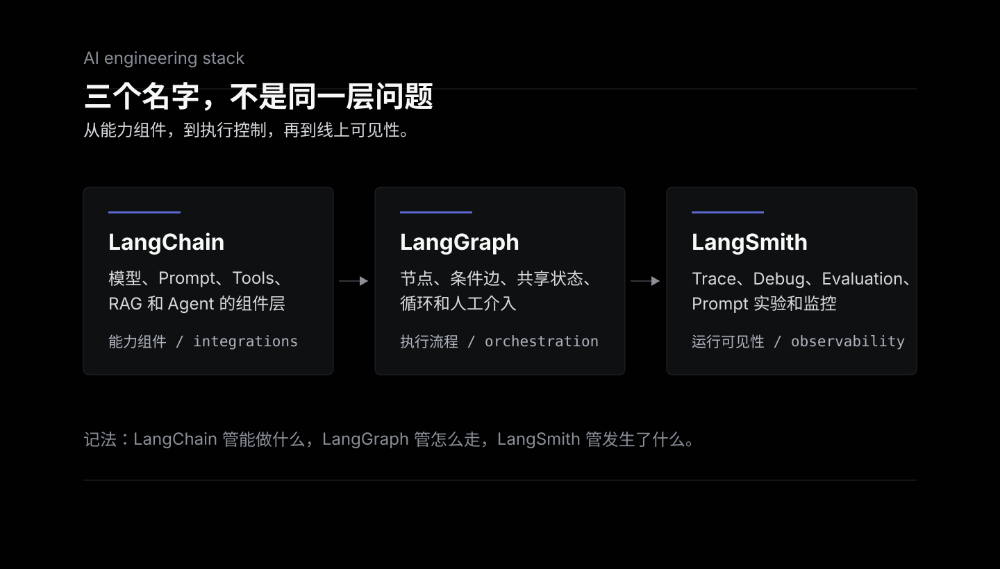
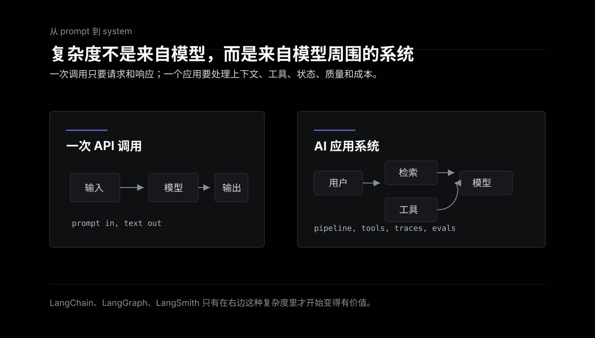
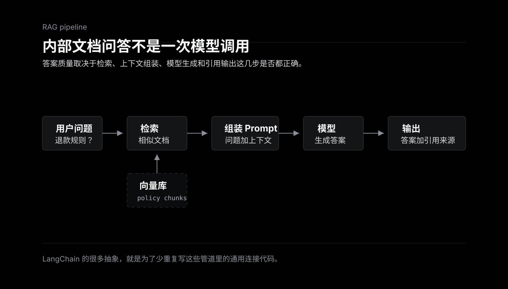
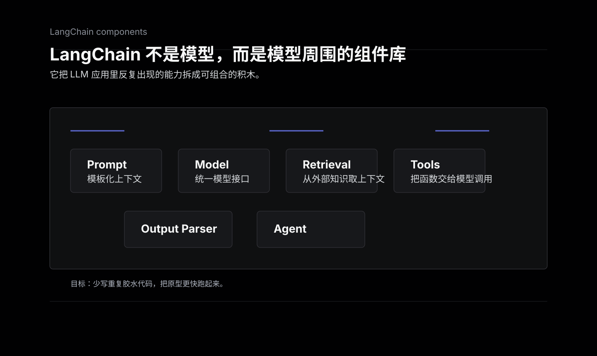
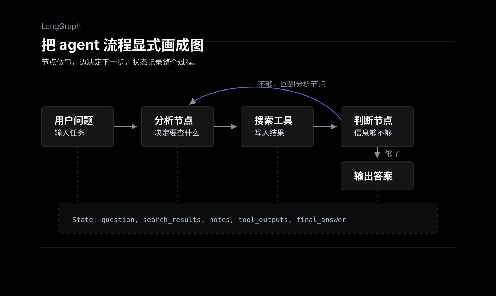
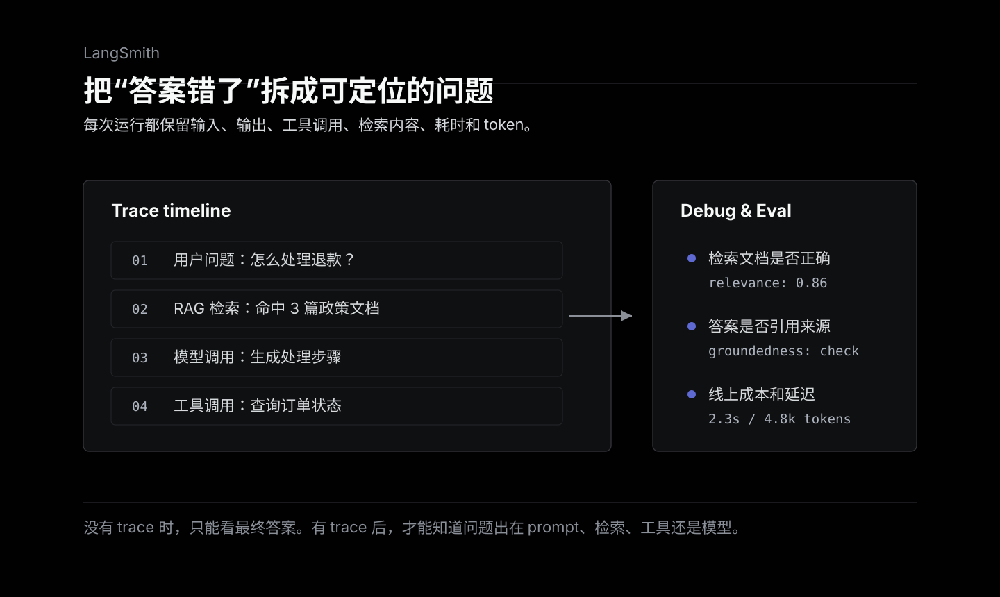
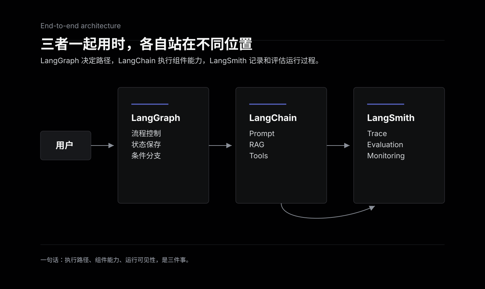
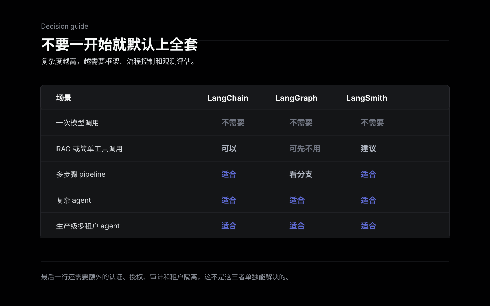
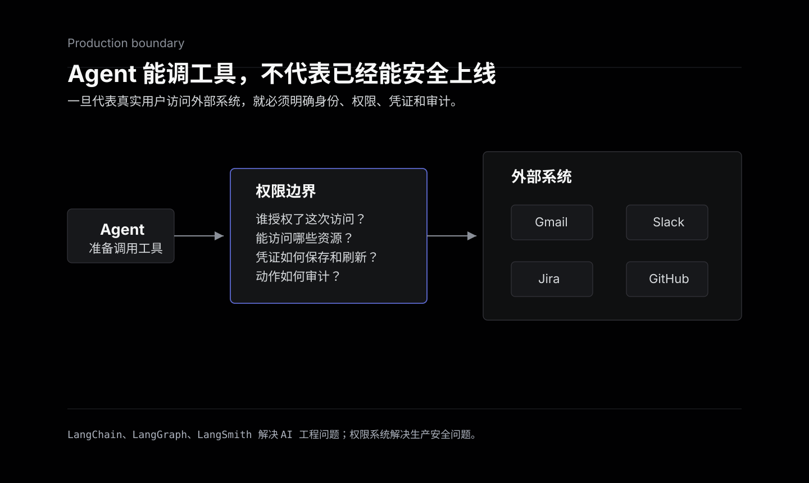

这几个名字很容易混在一起。尤其是 LangChain 早期给人的印象是“写 chain、做 RAG 的框架”，后来又出现 LangGraph、LangSmith，很多文章会把它们统一叫 LangChain 生态，但实际写代码时它们解决的是三类问题。

简单说：

- LangChain：帮你连接模型、提示词、工具、检索这些组件。
- LangGraph：帮你组织复杂 agent 的流程、状态、分支和循环。
- LangSmith：帮你观测、调试、评估和部署 AI 应用。

如果用一句工程化的话概括，LangChain 管“能力组件”，LangGraph 管“执行流程”，LangSmith 管“运行可见性”。



## 从一次 API 调用开始

最简单的 LLM 应用其实不需要什么框架。

```text
用户输入 -> 调用模型 API -> 返回文本
```

这种场景直接调 OpenAI、Anthropic、Gemini 的 SDK 就行，最多封装一下配置和错误处理。引入 LangChain 反而可能增加理解成本。



问题出现在应用稍微复杂一点之后。比如做一个内部文档问答：

1. 用户问一个问题。
2. 系统先去文档库里找相关内容。
3. 把相关内容拼进 prompt。
4. 调用模型生成答案。
5. 对答案做格式化，可能还要附上引用来源。

这已经不是一次模型调用，而是一个 pipeline。再往后，如果模型还要调用搜索、数据库、工单系统、日历、CRM，那就不只是“生成文本”，而是在真实系统里执行动作。



LangChain 这一套工具，就是从这个复杂度开始变得有价值的。

## LangChain：把 LLM 应用里的常用组件标准化

LangChain 是一个开源框架，官方现在更强调它是一个 agent framework：提供预置 agent 架构，以及连接模型和工具的集成能力。它的价值不是让你少写一行 API 调用，而是把 LLM 应用里反复出现的组件抽象出来。

常见组件包括：

- 模型接口：不同模型供应商的 API 格式不一样，LangChain 尝试提供统一调用方式。
- Prompt 模板：把动态上下文、用户输入、系统约束放进可复用模板，而不是散落在代码里的字符串。
- Tools：把普通函数、API、搜索、数据库查询包装成模型可以调用的工具。
- Retrieval / RAG：从文档、向量库或其他数据源检索相关上下文，再交给模型回答。
- Agent：让模型在“思考、选择工具、执行、观察结果、继续下一步”的循环里完成任务。



比如你要写一个 agent，让它能根据用户问题决定是否查询天气、搜索资料或读取文档。LangChain 提供的就是这些基础积木。

但 LangChain 也有一个常见问题：抽象层多。对于很简单的需求，它会显得重；一旦出问题，你可能要顺着框架内部追很多层才能找到真正的业务逻辑。它更适合这类场景：

- 你要快速接入多个模型供应商。
- 你有 RAG、工具调用、agent 这些通用需求。
- 你希望先用一个成熟框架把原型跑起来。

如果只是“输入一段文本，让模型总结一下”，直接调 API 更清楚。

## LangGraph：把 agent 流程显式画成图

当 agent 开始调用工具后，一个更麻烦的问题会出现：流程不再是线性的。

普通 chain 更像一条固定 pipeline：检索文档、调用模型、格式化结果。但真实 agent 会分支，会循环，会根据中间结果决定下一步。比如研究型 agent 可能先搜索，读结果，发现不够，再换关键词搜索，最后整理答案。这个流程用单向 pipeline 表达会很别扭。

LangGraph 解决的就是这个问题。它把 AI 应用组织成 graph：

- Node：一个执行步骤，可以是模型调用、工具调用、检索、普通函数。
- Edge：步骤之间的连接关系，可以是固定跳转，也可以是条件跳转。
- State：图运行过程中的共享状态，每个节点读取并更新它。

这样一来，agent 的控制流就变得显式。哪个节点负责思考，哪个节点负责调用工具，什么条件下继续循环，什么条件下结束，都可以在图里表达出来。

LangGraph 官方也把它定位成偏底层的 orchestration runtime，重点是长时间运行、有状态、可恢复的 agent。它提供的能力包括 durable execution、persistence、human-in-the-loop、streaming 等。



这里有个很重要的点：LangGraph 不一定非要和 LangChain 一起用。它可以独立使用。但 LangChain 现在的 agent 底层是构建在 LangGraph 上的，所以两者关系大概是：

- 想快速写一个普通 agent，用 LangChain。
- 想精细控制流程、状态、分支、循环，用 LangGraph。

## LangSmith：让 AI 应用能被调试和评估

传统程序出错，经常是抛异常、返回错误码、服务挂了。AI 应用更麻烦的地方在于，它可能看起来一切正常，只是答案错了。

比如一个 RAG 系统回答错了，问题可能出在很多地方：

- prompt 写得不好。
- 检索拿到了错误文档。
- 文档拿对了，但模型没有用。
- agent 选错了工具。
- 工具返回了结果，但中间状态被后续步骤覆盖了。
- 模型本身幻觉了。

如果没有 trace，只看最终答案，基本很难判断问题在哪里。

LangSmith 做的就是 AI 应用的观测、调试和评估。它会记录一次请求里的每个步骤：输入是什么，prompt 是什么，模型返回了什么，调用了哪些工具，工具返回了什么，检索到了哪些文档，每一步耗时和 token 使用情况如何。



有了这些 trace，才能回答几个生产环境里很现实的问题：

- 这次回答为什么错？
- 改了 prompt 之后质量是变好还是变差？
- 新版本是不是让延迟更高了？
- 哪些用户问题最容易失败？
- 工具调用是不是变多了，成本是不是上去了？

除了观测，LangSmith 还做 evaluation、prompt engineering 和 deployment。也就是说，它不只是一个日志平台，更像是面向 LLM / Agent 应用的工程平台。

LangSmith 最有价值的地方，是把“感觉这个 prompt 好像更好了”变成“用同一批测试集跑一遍，看指标有没有提升”。AI 应用如果没有评估集，很容易进入玄学调参。

## 三者怎么一起工作

落到一个具体系统里，不需要把三者看成并列选择。比如做一个客服 agent，可以把它们放在不同层次上：

1. LangGraph 负责整体流程：先分类问题，再决定查知识库、查订单系统，还是转人工。
2. LangChain 负责具体组件：调用模型、组织 prompt、接入检索、封装订单查询工具。
3. LangSmith 负责观察每一次运行：用户问了什么，查了哪些资料，调用了哪个工具，最后为什么给出这个答案。

这三个东西不是同一层的竞品，而是分别站在不同位置上：LangGraph 决定路径，LangChain 提供组件能力，LangSmith 记录和评估运行过程。



## 什么时候需要，什么时候不需要

不要一开始就默认上全套。

只做一次模型调用：

- 不需要 LangChain。
- 不需要 LangGraph。
- 不需要 LangSmith。
- 直接用模型 SDK，写清楚日志和错误处理。

做 RAG 或简单工具调用：

- 可以考虑 LangChain。
- 如果流程基本线性，LangGraph 不一定需要。
- 如果准备长期迭代，最好尽早接入 LangSmith 或类似 tracing。

做复杂 agent：

- LangGraph 会明显有价值。
- 分支、循环、状态、人工审批、失败恢复，这些越多，越应该把流程显式建模。
- LangSmith 基本也应该配上，否则后面很难排查线上问题。

做生产级多租户 agent：

- 这三者还不够。
- 你还要单独解决认证、授权、审计、用户隔离、工具权限、token 管理这些问题。



当 agent 要代表真实用户去访问 Gmail、Slack、Jira、GitHub 这类系统时，问题就不只是工具调用，而是身份、授权和权限边界。它用谁的身份访问，能访问什么，用户是否授权过，都需要额外的权限系统或工具调用网关处理。这不是 LangChain、LangGraph、LangSmith 本身能完全解决的问题。



## 总结

LangChain、LangGraph、LangSmith 的关系，可以按复杂度来记：

- LangChain 解决“怎么把模型、prompt、工具、检索组装起来”。
- LangGraph 解决“复杂 agent 怎么控制流程、保存状态、处理分支和循环”。
- LangSmith 解决“运行后怎么观察、调试、评估和持续改进”。

如果只是写一个简单 LLM 功能，不用急着引入它们。真正需要这套栈的场景，是应用开始变成一个系统：有检索、有工具、有多步骤推理、有线上质量问题、有持续评估需求。

过去大家说 AI 应用，重点经常是 prompt 怎么写。现在更像是在做系统设计：上下文怎么来，工具怎么接，状态怎么流转，失败怎么恢复，质量怎么评估。这也是 LangChain、LangGraph、LangSmith 这三个名字会经常一起出现的原因。

## 参考

- [Stop Confusing LangChain, LangGraph, and LangSmith | Full Breakdown](https://www.youtube.com/watch?v=e-GR3PlEOVU)
- [LangChain overview](https://docs.langchain.com/oss/python/langchain/overview)
- [LangGraph overview](https://docs.langchain.com/oss/python/langgraph/overview)
- [LangGraph persistence](https://docs.langchain.com/oss/python/langgraph/persistence)
- [LangSmith docs](https://docs.langchain.com/langsmith/home)
- [LangSmith platform](https://www.langchain.com/langsmith-platform)
