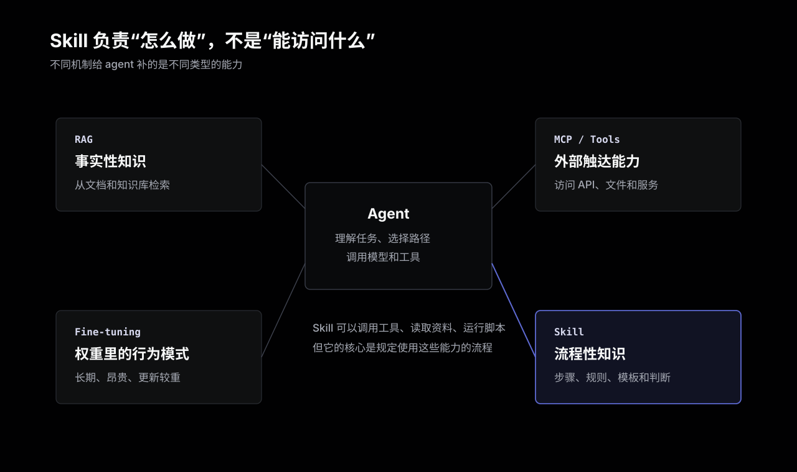
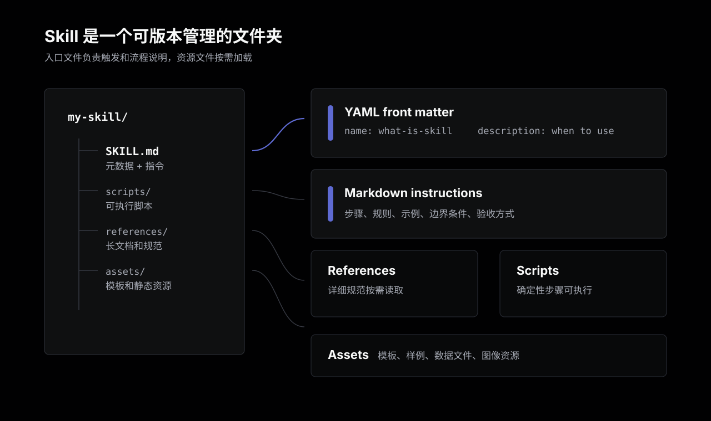
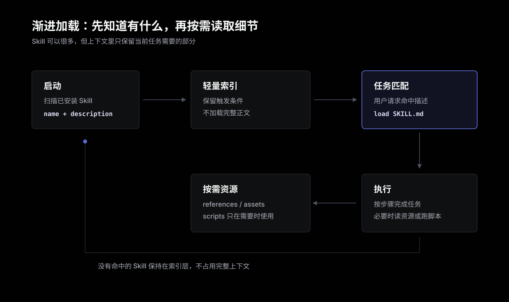

Skill 不是换了名字的插件系统，也不是把一堆资料塞进模型上下文。它解决的是另一个更具体的问题：把“怎么做一件事”的流程性知识交给 agent。

大模型本身知道很多事实，也能通过工具访问外部系统。但真实工作里的麻烦经常不在“知不知道”，而在“按什么顺序做、遇到边界怎么判断、输出要符合什么约定”。这些东西如果每次都写进 prompt，成本很高；如果不写，agent 就会凭通用经验猜。

Skill 的价值，就是把这些可重复的做事方法沉淀成一个可安装、可版本管理、可复用的文件夹。agent 在需要时加载它，按里面的步骤、规则、示例、脚本和模板完成任务。

## 先从一个普通任务开始

假设要让 agent 生成一份公司内部财务报告。这个任务可能不只是“写一份报告”：

1. 先读取指定表格。
2. 校验缺失字段。
3. 按部门口径聚合数据。
4. 使用固定模板生成摘要。
5. 检查敏感字段是否外泄。
6. 输出 PDF 和一份审阅清单。

这些步骤不是模型预训练里天然知道的通用事实，而是某个团队、某个系统、某类交付物里的流程约定。没有 Skill 时，只有两种办法：

- 每次把完整流程重新告诉 agent。
- 不告诉它，让它根据任务名自己猜。

前者浪费上下文，也容易漏步骤；后者看起来省事，实际最不稳定。Skill 把这类流程放到 agent 可读取的长期能力里，让“每次都要解释一遍”的东西变成项目资产。

## Skill 解决的是流程性知识

可以把 agent 需要的知识粗略分成三类：

- 事实性知识：某个 API 怎么用，某个政策文本写了什么，某篇文档里的定义是什么。
- 情节性知识：之前和用户聊过什么，这次任务已经做到了哪一步。
- 流程性知识：做某类任务时应该按什么方法、顺序和判断标准执行。

Skill 主要处理第三类。



这也是它容易和其他概念混在一起的地方。RAG 解决的是“查什么资料”；MCP 解决的是“能调用什么外部能力”；微调解决的是“模型权重里长期学到什么行为模式”。Skill 更像是“执行手册”：告诉 agent 在一个具体场景里该怎么组织这些能力。

## 一个 Skill 长什么样

最小的 Skill 是一个文件夹，里面有一个 `SKILL.md`。这个文件由两部分组成：

- YAML front matter：至少包含 `name` 和 `description`。
- Markdown 正文：写具体说明、流程、规则、示例、边界条件。

典型目录结构大概是这样：

```text
my-skill/
  SKILL.md
  scripts/
  references/
  assets/
```



`name` 用来标识 Skill；`description` 更关键，它告诉 agent 这个 Skill 做什么，以及什么时候应该使用。一个含糊的描述，比如“帮助处理 PDF”，很难被稳定触发。更好的写法应该包含任务边界和触发词，例如“当用户需要抽取 PDF 文本、填写 PDF 表单或合并多个 PDF 文件时使用”。

`SKILL.md` 的正文才是主要知识。它可以写：

- 分步骤工作流。
- 输入和输出格式。
- 常见边界条件。
- 失败时如何处理。
- 需要调用哪些脚本或读取哪些参考文件。
- 最后如何验证结果。

可选目录则负责把主说明拆开：

- `scripts/`：放可执行脚本，比如 Python、Bash、JavaScript。
- `references/`：放较长的说明文档、规范、字段解释。
- `assets/`：放模板、示例文件、图片、数据表等静态资源。

这样做的好处是，`SKILL.md` 可以保持像入口说明一样清楚，复杂细节按需放进其他文件。

## 它不是一次性把所有内容塞进上下文

如果一个 agent 安装了几十个甚至上百个 Skill，不可能启动时把每个 `SKILL.md` 全部读进上下文。那样还没开始工作，token 预算就已经被耗掉了。

Skill 依靠渐进加载解决这个问题。



通常可以分三层理解：

1. 启动时只加载元数据：也就是每个 Skill 的 `name` 和 `description`。
2. 当任务匹配某个 Skill 的描述时，再读取完整 `SKILL.md`。
3. 只有在具体步骤需要时，才继续读取 `references/`、`assets/` 或运行 `scripts/`。

所以 `description` 不是摆设。它相当于 Skill 的触发条件。如果写得太宽，agent 可能乱用；写得太窄，相关任务又可能触发不了。一个好的 description 应该同时回答：

- 这个 Skill 能做什么。
- 用户怎么表达时应该使用它。
- 什么相邻任务不属于它。

## 和 MCP、RAG、微调的边界

Skill 经常和 MCP、RAG、微调一起出现，但它们不在同一层。

| 机制 | 主要解决的问题 | 不擅长解决的问题 |
| --- | --- | --- |
| MCP | 让 agent 能访问外部工具、API、文件、服务 | 不告诉 agent 业务流程和判断标准 |
| RAG | 从知识库里检索事实、文档、上下文 | 不负责把任务拆成稳定流程 |
| 微调 | 把行为偏好或知识模式写进模型权重 | 更新成本高，不适合频繁变化的团队流程 |
| Skill | 把可重复工作流、规则、示例和资源打包 | 不直接提供外部访问能力，也不替代权限系统 |

一个实际系统里，它们往往组合使用。

比如要做“审阅合同并生成风险摘要”，MCP 可以让 agent 访问文档系统，RAG 可以检索公司法务规范，Skill 负责规定审阅顺序、风险分类、输出模板和必须检查的条款。Skill 不替代这些能力，而是告诉 agent 怎么把这些能力用对。

## 什么时候适合写成 Skill

适合写成 Skill 的任务通常有几个特征：

- 会反复发生，不是一次性需求。
- 有固定步骤，但中间需要判断。
- 输出有明确格式或质量标准。
- 需要复用模板、脚本、检查清单或参考规范。
- 团队希望这个做法能被版本管理、审阅和共享。

比如：

- 代码评审时按照团队规则检查安全、测试、迁移风险。
- 把一批 Markdown 文章同步到 Notion，并处理图片、front matter、属性映射。
- 按公司模板生成 PPT 或 PDF，并做渲染校验。
- 为某个仓库执行固定排障流程：读日志、跑测试、定位配置、输出复盘。
- 写博客时遵守固定语气、目录、配图和 Hugo front matter 约定。

不适合写成 Skill 的内容也很明确：

- 单次临时 prompt。
- 经常变化的事实资料，应该放文档库或 RAG。
- 单纯的 API 连接，应该用 MCP 或工具集成。
- 需要强权限控制、审计、租户隔离的能力，不能只靠 Skill。
- 来源不可信、包含脚本但没人审阅的第三方 Skill。

Skill 的边界越清楚，agent 越容易正确使用它。一个“做所有事情都更专业”的 Skill 基本不可用，因为它没有明确触发条件，也没有可验证的交付标准。

## 怎么写一个可用的 Skill

写 Skill 不只是把提示词放进文件。更接近写一份给 agent 使用的操作手册。

一个可用 Skill 至少要做到这几件事：

1. 任务边界明确：说明适用场景，也说明不适用场景。
2. 触发描述具体：`description` 里放用户可能使用的关键词和任务类型。
3. 步骤可执行：不要只写原则，要写先做什么、再做什么、失败怎么处理。
4. 输出可检查：给出格式、命名、验收标准或示例输出。
5. 长资料拆出去：把大段规范放进 `references/`，不要让入口文件变成杂物间。
6. 脚本要可审阅：脚本说明依赖、输入、输出、失败信息，不要隐藏副作用。

一个好 Skill 最重要的不是“写得长”，而是让 agent 在关键选择点上少猜。它应该把经验里的判断标准写出来：什么时候要停下来问用户，什么时候可以直接执行，哪些文件不能改，哪些命令跑完才算验证通过。

## 安全边界

Skill 可以包含脚本，也可能读取本地文件、环境变量、API key 或项目资料。这个能力很有用，但也意味着它更像软件依赖，而不是普通文本片段。

安装第三方 Skill 前，至少应该检查：

- `SKILL.md` 里有没有隐藏指令、越权行为或奇怪的触发条件。
- `scripts/` 会读写哪些文件，会不会访问网络。
- 是否要求不必要的环境变量或密钥。
- 是否会绕过人工确认执行危险操作。
- 来源、版本和许可证是否可信。

对团队来说，Skill 最好进入正常代码审查流程。因为它会影响 agent 的行为，也可能间接影响代码、文档、数据和凭据安全。

## 总结

Skill 可以理解成 agent 的流程性记忆：它把一类可重复任务的做法、步骤、规则、示例、脚本和模板打包起来，让 agent 在合适的时候加载并执行。

它不替代模型能力，也不替代工具系统。模型负责理解和生成，MCP 这类协议负责连接外部能力，RAG 负责查资料，Skill 负责把“这件事应该怎么做”变成可复用的流程。

真正有价值的 Skill，通常来自已经跑过很多遍的工作流。先在实际任务里把流程跑清楚，再沉淀成 Skill；不要反过来为了显得自动化，先写一个范围很大的 Skill。Agent 最需要的不是更多口号，而是更少猜测。

## 参考

- [What AI Agent Skills Are and How They Work | IBM Technology](https://www.youtube.com/watch?v=Lg-meK5IU8Q)
- [Agent Skills Overview](https://agentskills.io/)
- [Agent Skills Specification](https://agentskills.io/specification)
- [Skills in ChatGPT | OpenAI Help Center](https://help.openai.com/en/articles/20001066)
- [Claude Code Skills](https://docs.claude.com/en/docs/claude-code/skills)
