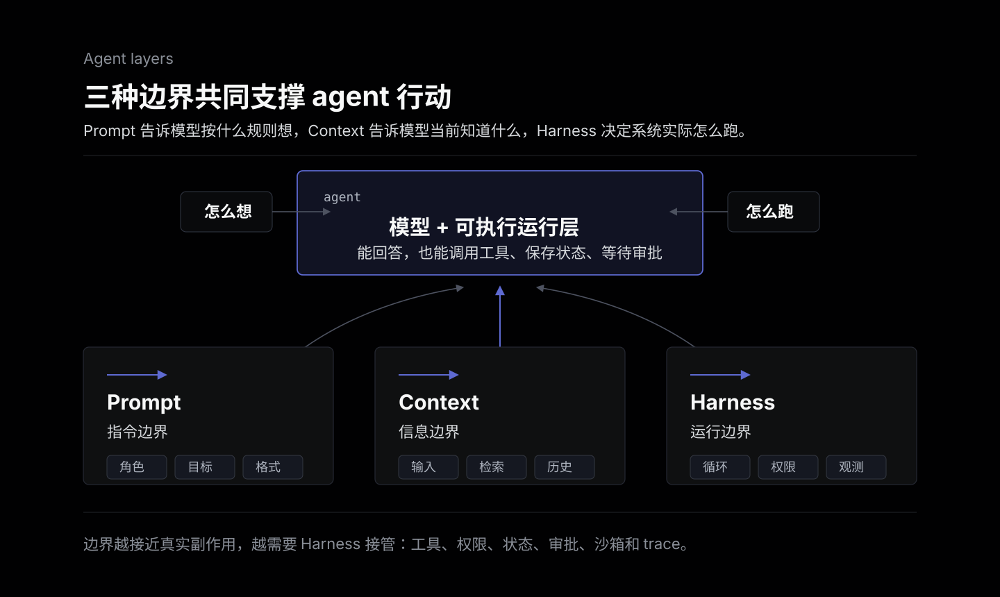
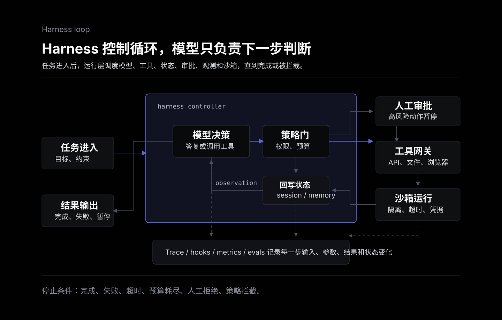

Agent Harness 这个词容易听起来很新，但它指向的问题并不新：当 agent 不再只是回答问题，而是要多轮思考、调用工具、读写状态、处理失败、等待人工确认，并在真实系统里执行动作时，模型本身已经不是系统的全部。

Prompt 决定模型“应该怎么想”，Context 决定模型“当前知道什么”，Harness 决定 agent “实际怎么跑”。它是包在模型外面的运行层：负责循环、状态、工具、权限、可观测性、评估、运行环境和安全边界。

可以先用一句话区分：

- Prompt Engineering：把指令写清楚。
- Context Engineering：把任务所需的信息组织好。
- Harness Engineering：把 agent 的运行过程管起来。

如果一个 AI 功能只是“输入文本，返回文本”，通常不需要单独谈 harness。真正需要它的时候，是模型开始代表用户或系统去做事。



## 从一次模型调用开始

最简单的 AI 功能只有一条线：

```text
用户输入 -> 模型调用 -> 返回结果
```

这种场景里，prompt 和 context 基本就够了。写好系统提示词，拼好用户输入，补一点检索资料，最后调用模型 API。工程重点是配置、错误处理、日志和成本控制，不需要把问题讲成“agent 平台”。

复杂度上来之后，事情会变成另一种形态：

1. 用户给一个目标，而不是一个问题。
2. 模型需要判断下一步做什么。
3. 系统要提供工具，比如搜索、数据库、GitHub、浏览器、文件系统。
4. 工具调用结果要回到模型上下文。
5. agent 可能要继续循环，也可能要停下来请求人工审批。
6. 整个过程要能被追踪、调试、评估和恢复。

这时问题不只是“prompt 怎么写”，而是“这个会自己行动的系统怎么被约束、观察和迭代”。Harness 负责的就是这一层。

## Agent Harness 包含什么

一个可用的 harness 通常至少有这些部分。

**Agent loop**

Agent loop 是运行闭环。模型读入任务和上下文，决定输出最终答案还是调用工具；工具执行后返回 observation；模型再基于新观察继续下一步，直到完成、失败、超时或被人工打断。

这个循环可以很简单，也可以变成显式的 graph。重点不在名字，而在控制权：谁决定下一步，什么条件下继续，什么条件下停止。

**工具与权限**

工具不是普通函数列表。只要 agent 能调用外部系统，就会出现权限问题：它能读什么文件，能不能写数据库，能不能发消息，能不能创建 PR，能不能删除资源。

好的 harness 不只是把工具暴露给模型，还要定义工具描述、参数 schema、调用约束、权限边界、审批策略和失败处理。工具越接近真实副作用，越不能只靠 prompt 约束。

**上下文与状态**

Context 是给模型看的当前输入，state 是系统运行过程中保存的事实。两者相关，但不是一回事。

比如一次长任务里，agent 可能需要保存已读文件、已调用工具、用户确认、当前计划、临时结果和错误信息。这些不应该全靠模型在上下文里“记住”。Harness 要决定哪些状态持久化，哪些只进入当前上下文，哪些应该被截断或压缩。

**生命周期 hooks**

Hooks 是在关键节点插入自定义逻辑：模型调用前、模型调用后、工具调用前、工具调用后、循环结束时、异常发生时。

它们解决的是工程系统经常需要的横切逻辑，比如记录 trace、注入额外上下文、拦截危险工具、做输入输出检查、统计成本、触发人工审批。没有 hooks，这些逻辑很容易散落在业务代码里。

**可观测性与评估**

Agent 出错不一定会抛异常。它可能流程跑完了，只是查错资料、选错工具、漏掉约束，或者给出一个看似合理但不可用的答案。

所以 harness 需要记录每一步：模型输入输出、工具参数、工具结果、状态变化、耗时、错误、人工审批和最终结果。Trace 用来解释“这次为什么这样回答”，评估用来回答“改完之后整体有没有变好”。

**沙箱与运行时**

当 agent 需要跑代码、操作浏览器、访问文件系统或处理用户数据时，运行环境本身就是边界。沙箱、临时工作区、网络限制、凭据隔离、超时、资源限制和会话恢复，都属于 harness 的工作。

Anthropic 在 Managed Agents 的架构说明里，把 session、harness、sandbox 分得很清楚：session 是可恢复的事件日志，harness 是调用模型并路由工具的循环，sandbox 是执行代码和修改文件的隔离环境。这个拆法很实用，因为它提醒我们不要把所有问题都塞进“agent 代码”。

**人类审批**

Human-in-the-loop 不是给界面加一个确认按钮那么简单。它需要回答：哪些动作必须审批，审批时展示什么上下文，用户拒绝后怎么恢复，审批记录怎么审计，超时后怎么处理。

一旦 agent 能做有副作用的事，人类审批就应该成为运行层的一等能力，而不是某个工具函数里的临时判断。



## Prompt、Context、Harness 的边界

这三个词经常被放在一起，但它们解决的层次不同。

Prompt 更像“指令层”。它告诉模型角色、目标、格式、约束和思考方式。Prompt 的问题是，只要任务需要外部状态、长期记忆、工具权限和失败恢复，它就不够了。不能指望一句“请谨慎调用工具”替代权限系统。

Context 更像“信息层”。它负责把当前任务需要的资料放到模型面前，比如用户输入、检索结果、历史摘要、文件片段、工具返回值。Context 的问题是，它会受到窗口长度、信息噪声和时效性的限制。上下文组织得好，模型更容易做对；但它仍然不负责运行控制。

Harness 更像“执行层”。它不直接提高模型智商，而是让模型在一个可控环境里行动：什么时候调用模型，什么时候调用工具，怎么保存状态，怎么处理错误，怎么审计，怎么暂停，怎么恢复。

可以粗略记成：

| 层次 | 主要问题 | 典型产物 |
| --- | --- | --- |
| Prompt | 模型应该按什么规则输出 | system prompt、工具描述、输出格式 |
| Context | 模型当前应该知道什么 | RAG 片段、会话历史、状态摘要 |
| Harness | agent 运行过程如何被控制 | loop、hooks、state、trace、sandbox、approval |

这也是为什么“更会写 prompt”不能自然推出“更会做 agent”。Prompt 是必要输入，但 production agent 的风险大多出现在模型之外。

## 和几个常见框架的关系

Agent Harness 不是某一个框架的专有名词，更像一个工程视角。不同工具覆盖其中不同部分。

**LangChain / LangGraph**

LangChain 更偏组件层：模型、prompt、工具、检索、agent 抽象。LangGraph 更偏流程和状态层：节点、边、循环、持久化、人类介入。用这套词来说，LangGraph 更接近 harness 里的 orchestration 部分，但它不是完整生产边界。认证、授权、租户隔离、工具网关和运行沙箱仍然要额外设计。

**Strands Agents**

Strands 把 agent loop、model、tools、prompts、hooks、session/state 这些概念拆得比较直接。它适合作为理解 harness 的工程样本：agent 不是一次模型调用，而是一个运行循环，循环里有工具、状态、事件和生命周期扩展点。

**OpenAI Agents SDK**

OpenAI Agents SDK 提供 agent、handoff、guardrails、tracing 等概念。Guardrails 适合做输入输出检查和安全约束，tracing 适合看运行过程。它覆盖了 harness 的一部分，但业务权限、具体工具副作用、部署环境和数据边界仍然要由应用侧设计。

**Amazon Bedrock AgentCore**

Bedrock AgentCore 更偏生产运行时和平台层，关注 agent 部署、会话、身份、工具、记忆、浏览器/代码解释器、观测等能力。它不是告诉你“prompt 怎么写”，而是把 agent 跑到生产环境时需要的基础设施做成服务。

**Anthropic 的长任务 agent 拆分**

Anthropic 对长时间运行 agent 的拆分很值得借鉴：model、tools、prompts 之外，还要有 session、harness 和 sandbox。这里的重点不是照搬某个实现，而是承认 agent 工程里有三类不同问题：模型行为、控制逻辑、隔离运行环境。

## 什么时候需要 Harness Engineering

可以用几个信号判断是否需要认真设计 harness。

需要的场景：

- agent 会多步执行，而不是一次回答。
- agent 会调用多个工具，并根据结果决定下一步。
- 工具有真实副作用，比如写文件、发消息、改数据、创建订单、提交代码。
- 任务会跨越较长时间，需要暂停、恢复或保存中间状态。
- 线上需要解释失败原因，不能只看最终答案。
- 需要人工审批、审计记录或权限隔离。
- 同一个 agent 要服务多个用户、租户或团队。

不需要过度设计的场景：

- 只是一次模型调用。
- 只是固定 RAG 问答，流程线性且没有副作用。
- 工具很少，而且都只读。
- 只是个人脚本或内部原型，失败成本很低。
- 需求还没稳定，先用清楚的业务代码更划算。

不要为了“像 agent 平台”而上全套。很多时候，一个明确的函数调用流程、一张状态表、几条工具白名单、基础日志和人工确认，就已经是够用的 harness。等到循环、状态、权限和观测开始变复杂，再引入 LangGraph、Strands、Agents SDK 或 AgentCore 这类工具会更自然。

## 一个实用的设计顺序

做 harness 不必一上来设计平台。更稳的顺序是：

1. 先明确 agent 能做什么，不能做什么。
2. 把工具按只读、低风险写入、高风险副作用分级。
3. 写清 agent loop 的停止条件、重试条件和超时条件。
4. 把状态从上下文里拆出来，决定哪些需要持久化。
5. 在模型调用和工具调用前后加 trace。
6. 对高风险工具加入人工审批。
7. 建一小批评估任务，用来比较 prompt、工具描述和流程改动。
8. 如果任务需要执行代码或浏览器操作，再单独设计沙箱。

这个顺序的好处是，复杂度来自真实风险，而不是来自框架清单。

## 总结

Agent Harness 可以理解成 agent 的运行层。它不替代 prompt，也不替代 context，而是把模型放进一个可执行、可观察、可约束、可恢复的系统里。

Prompt 让模型知道怎么回答，context 让模型知道当前有什么信息，harness 让 agent 在真实世界里按规则行动。

当 AI 应用还停留在“生成一段文本”时，不需要把 harness 讲得很重。等它开始调用工具、保存状态、处理副作用、接受人工审批、进入生产环境，Harness Engineering 就会从可选项变成主问题。那时最关键的能力不是写更长的提示词，而是让 agent 少猜、少越界、可追踪、可回放、可停止。

## 参考

- [最近爆火的 Harness Engineering 到底是个啥？一期讲透！](https://www.youtube.com/watch?v=3DlXq9nsQOE)
- [What is an Agent Harness? (And How We Built One)](https://www.youtube.com/watch?v=hcm5zIWASCM)
- [Strands Agents: Agent Loop](https://strandsagents.com/docs/user-guide/concepts/agents/agent-loop/)
- [Strands Agents: Prompts](https://strandsagents.com/docs/user-guide/concepts/agents/prompts/)
- [Strands Agents: Model Providers](https://strandsagents.com/docs/user-guide/concepts/model-providers/)
- [Strands Agents: Hooks](https://strandsagents.com/docs/user-guide/concepts/agents/hooks/)
- [Introducing Strands Agents, an Open Source AI Agents SDK](https://aws.amazon.com/blogs/opensource/introducing-strands-agents-an-open-source-ai-agents-sdk/)
- [What is Amazon Bedrock AgentCore?](https://docs.aws.amazon.com/bedrock-agentcore/latest/devguide/what-is-bedrock-agentcore.html)
- [Amazon Bedrock AgentCore Runtime](https://docs.aws.amazon.com/bedrock-agentcore/latest/devguide/agents-tools-runtime.html)
- [A practical guide to building agents](https://openai.com/business/guides-and-resources/a-practical-guide-to-building-ai-agents/)
- [OpenAI Agents SDK: Guardrails](https://openai.github.io/openai-agents-python/guardrails/)
- [Building effective agents](https://www.anthropic.com/engineering/building-effective-agents)
- [Scaling Managed Agents: Decoupling the brain from the hands](https://www.anthropic.com/engineering/managed-agents)
- [Effective harnesses for long-running agents](https://www.anthropic.com/engineering/effective-harnesses-for-long-running-agents)
- [Anthropic computer use tool](https://docs.anthropic.com/en/docs/agents-and-tools/tool-use/computer-use-tool)
- [What is an Agent Harness?](https://arize.com/blog/what-is-an-agent-harness/)
