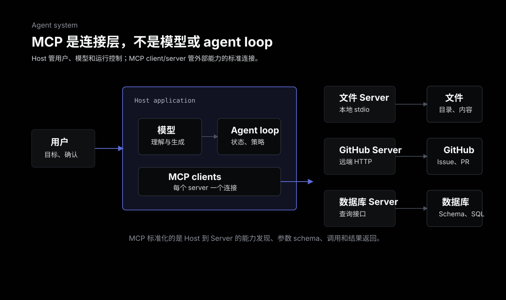
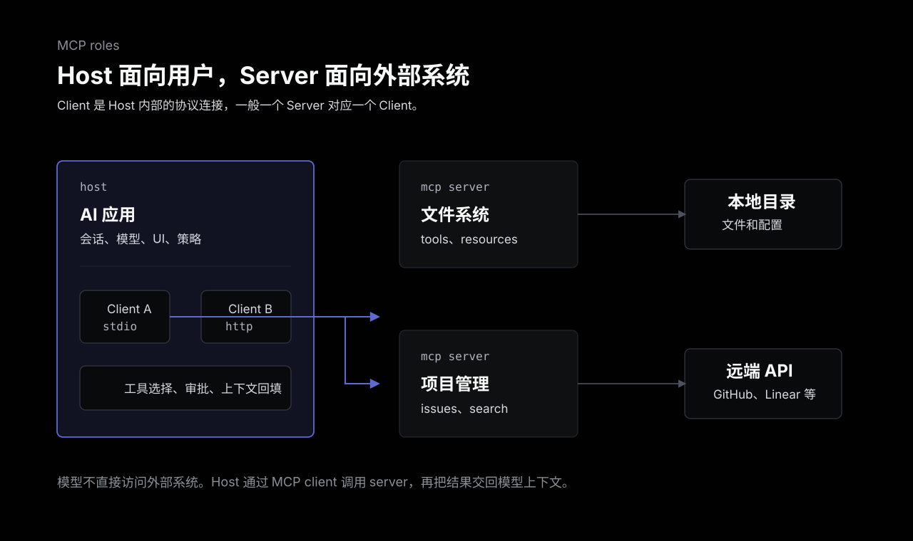
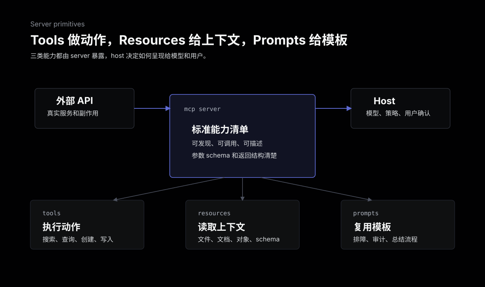
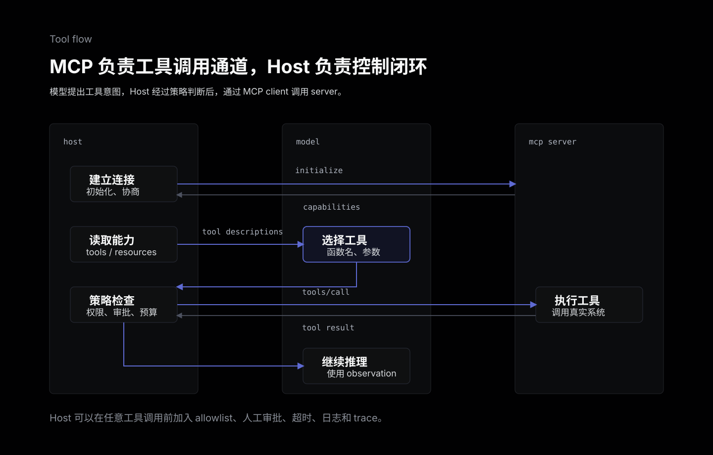
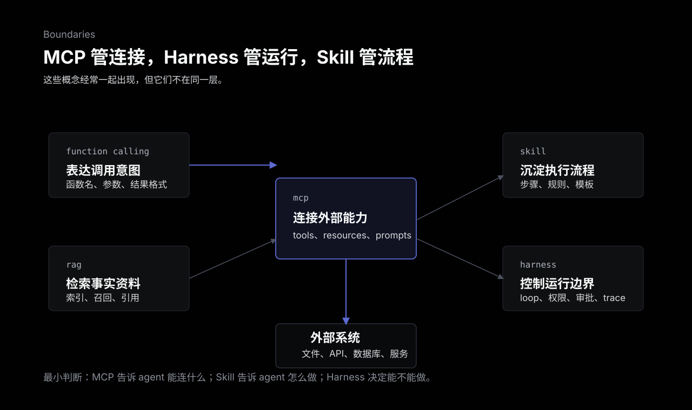

Agent MCP 不是一种新的 agent，也不是让模型变聪明的提示词技巧。MCP 全称是 Model Context Protocol，它解决的是一个更工程化的问题：agent 要访问外部系统时，连接方式不要每次都从零硬编码。

如果一个 AI 功能只是“用户输入一段话，模型返回一段话”，基本不需要 MCP。真正需要它的时候，是 agent 开始接触外部世界：读文件、查数据库、访问 GitHub、操作浏览器、调用公司内部服务、读取知识库、生成工单，或者把这些能力组合成多步任务。

可以先用一句话理解：

> MCP 是 AI 应用和外部工具、资源、提示模板之间的标准协议层。

它不替代模型，不替代 agent loop，也不替代权限系统。它更像一个连接规范：让 host 应用知道有哪些 server，可以用哪些 tools，能读哪些 resources，有哪些 prompts 可以复用，以及这些能力应该用什么 schema 调用。



## 从硬编码工具调用开始

最简单的工具调用不需要 MCP。

比如一个客服 agent 需要查询订单状态，可以在代码里写一个函数：

```text
get_order_status(order_id) -> order_status
```

然后把这个函数注册给模型。模型判断需要查订单时，返回函数名和参数；业务代码执行函数，再把结果塞回上下文。这就是很多模型 API 里的 function calling / tool calling 的基本形态。

这种方式在小系统里很清楚。但问题会在规模上来之后出现：

1. 每接一个外部系统，都要在当前应用里写一遍集成。
2. 不同 agent 应用想用同一个工具时，很难复用。
3. 工具描述、参数 schema、认证、错误处理、日志和权限边界会散落在各处。
4. 外部系统更新后，多个 agent 应用都要跟着改。

MCP 的价值不是“让模型会调用函数”。模型工具调用本来就可以做到。MCP 解决的是“这些外部能力怎么被标准化暴露、发现、连接和复用”。

## MCP 解决什么问题

MCP 把一个常见的集成问题拆成三层：

- AI 应用负责和用户、模型、agent loop 交互。
- MCP client 负责按协议连接某个 MCP server。
- MCP server 负责把外部系统包装成标准能力。

这就把原来写死在 agent 应用里的集成逻辑，移到一个可复用的 server 里。一个 GitHub MCP server 可以服务 Claude Desktop、ChatGPT、OpenAI Agents SDK 应用、公司内部 agent 平台，或者任何支持 MCP 的 host。

这个拆分有几个直接好处：

- 能力发现：host 可以询问 server 暴露了哪些 tools、resources、prompts。
- 参数规范：tool 用 JSON schema 描述输入，调用方不用猜字段。
- 连接复用：一个 server 可以被多个 host 使用。
- 边界清楚：server 负责和外部系统打交道，host 负责决定何时调用。
- 生态互通：工具集成不必绑定某一个模型供应商或 agent 框架。

注意这里有一个边界：MCP 只定义连接协议和能力形态，不自动保证“调用一定安全”。一个能写文件、发消息、改数据库的 MCP server，本质上就是一个有副作用的软件组件。它仍然需要权限、审计、沙箱和人工审批。

## Host、Client、Server 三个角色

理解 MCP 时，最容易混的是 host、client、server。

**Host** 是用户直接使用的 AI 应用，比如桌面助手、IDE agent、聊天应用、内部 agent 平台。Host 负责管理用户会话、模型调用、上下文、权限策略和 UI。

**Client** 是 host 里面用来连接 MCP server 的协议客户端。通常一个 server 对应一个 client 连接。Host 可以同时连接多个 server，比如文件系统 server、GitHub server、Postgres server、内部 CRM server。

**Server** 是提供能力的一端。它可以运行在本机，通过 stdio 和 host 通信；也可以运行在远端，通过 Streamable HTTP 这类传输方式通信。Server 后面再连接真实系统，例如文件系统、API、数据库、浏览器、SaaS 服务。

这里的 server 不是“模型服务器”。它不负责生成答案，而是负责把外部能力整理成 MCP 能理解的形式。



一个容易记的判断是：

- 用户打开的是 host。
- host 内部创建 client。
- client 连接 server。
- server 暴露外部能力。
- 模型通过 host 的 agent loop 间接使用这些能力。

所以严格说，不是“模型直接连上了 GitHub”，而是 host 根据模型的工具选择，通过 MCP client 调 GitHub MCP server，再把结果放回模型上下文。

## Server 暴露三类核心能力

MCP server 最常见的能力可以先记三类：tools、resources、prompts。



**Tools**

Tools 是可以执行的动作。比如：

- 搜索代码仓库。
- 查询数据库。
- 创建 issue。
- 读取一个文件。
- 调用内部 API。
- 运行一个受限脚本。

工具通常有明确输入 schema 和输出结果。只要工具有副作用，比如写文件、发请求、改数据，就应该进入更严格的权限和审批流程。

**Resources**

Resources 更像可读取的上下文。比如：

- 某个文件内容。
- 数据库 schema。
- 一份文档。
- 一个项目配置。
- 某个 URI 对应的业务对象。

它解决的是“agent 当前可以读什么资料”。Resources 不等于 RAG，但可以成为 RAG 或上下文组装的一部分。

**Prompts**

Prompts 是 server 提供的可复用提示模板。比如某个代码库的排障模板、某个系统的审计模板、某类工单的处理模板。它们不是模型能力本身，而是把领域里的固定工作方式包装成 host 可以发现和使用的提示入口。

MCP 还有一些更高级的能力，比如 server 请求 host 侧采样、向用户补充询问、记录日志、声明根目录等。理解主线时不必一开始就背完整清单。先抓住 tools、resources、prompts，就能看清 MCP 的主要价值。

## Agent 怎么通过 MCP 做事

一次典型调用可以拆成几个步骤：

1. Host 启动或用户授权后，创建 MCP client。
2. Client 和 server 建立连接，完成能力协商。
3. Host 拉取 server 暴露的 tools、resources、prompts。
4. Host 把可用工具描述放进模型上下文。
5. 模型判断下一步要不要调用某个工具。
6. Host 通过 MCP client 发起 tool call。
7. Server 执行真实外部动作，返回结果。
8. Host 把 observation 放回上下文，让模型继续下一步或输出答案。



这个流程里，MCP 不决定 agent 是否应该继续循环，也不决定危险动作是否允许执行。这些属于 host 和 agent harness 的职责。

换句话说，MCP 给 agent 接上了手和眼睛，但不是大脑，也不是刹车系统。

## 和 Function Calling、RAG、Skill、Harness 的边界

MCP 经常和几个概念一起出现，但它们解决的层次不同。

| 机制 | 主要解决的问题 | 和 MCP 的关系 |
| --- | --- | --- |
| Function Calling / Tool Calling | 模型如何表达“我要调用这个函数和参数” | MCP 可以提供这些函数背后的标准连接层 |
| RAG | 如何从知识库检索相关事实和文档 | MCP server 可以暴露资源或检索工具，但 RAG 仍要设计索引、召回和排序 |
| Skill | 某类任务应该按什么流程执行 | Skill 可以规定如何使用 MCP tools，但不提供连接协议 |
| Agent Harness | agent loop、状态、权限、审批、观测、沙箱如何运行 | Harness 负责控制 MCP 工具何时、如何、是否允许被调用 |



Function calling 解决的是模型输出格式。比如模型说“调用 `search_repo`，参数是 `{ "query": "auth middleware" }`”。MCP 解决的是这个 `search_repo` 能力从哪里来、schema 怎么暴露、调用怎么传输、结果怎么返回。

RAG 解决的是知识检索。MCP 可以把一个文档库、数据库或搜索服务包装成工具或资源，但检索质量仍然取决于切分、索引、召回、排序、引用和上下文压缩。

Skill 解决的是流程性知识。比如“写博客时先读写作规范，再看历史文章，最后运行 Hugo 验证”。这个 Skill 可以让 agent 调用文件系统 MCP、浏览器 MCP、Notion MCP，但 Skill 的核心是“怎么做”，MCP 的核心是“怎么连接”。

Harness 解决的是运行控制。它决定工具白名单、超时、预算、trace、重试、人类审批、沙箱和状态恢复。MCP server 可能暴露一个删除文件的 tool，但是否允许调用，应该由 host/harness 的策略决定。

## 什么时候需要 MCP

适合引入 MCP 的场景通常有这些信号：

- 一个 agent 需要连接多个外部系统。
- 同一组工具希望被多个 AI 应用复用。
- 工具 schema、认证、错误处理和日志不想散落在各个 agent 代码里。
- 团队希望把内部系统包装成统一的 agent 接入层。
- 需要同时支持本地工具和远端服务。
- 希望工具能力可以被 host 动态发现，而不是硬编码进 prompt。

不需要 MCP 的场景也很明确：

- 只是一次模型 API 调用。
- 只有一两个非常简单的本地函数。
- 原型还没稳定，直接写业务代码更快。
- 外部系统只有当前应用会用，复用价值很低。
- 安全边界还没想清楚，只是为了“接入更多工具”而接入。

不要把 MCP 当成 agent 的必要前置条件。很多 agent 原型先用普通 tool calling 就够了。等工具数量、复用需求、跨应用集成和权限边界开始变复杂，再把工具抽成 MCP server 会更自然。

## 安全边界

MCP server 不是普通文档，也不是无害插件。安装一个 MCP server，更接近安装一个能被 agent 调用的软件依赖。

至少要关注这些问题：

1. Server 能访问哪些文件、环境变量、网络地址和凭据。
2. Tools 是只读还是会产生副作用。
3. 高风险动作是否需要人工确认。
4. Tool 描述是否可能被恶意 prompt injection 利用。
5. 远端 server 的 OAuth、token、会话和租户隔离是否清楚。
6. 日志里是否会记录敏感输入、工具参数或返回值。
7. 多个 server 暴露同名或相似工具时，host 如何选择和限制。

最危险的做法，是把一个权限很大的 MCP server 接给 agent，然后只靠 prompt 写一句“请谨慎操作”。Prompt 是提醒，不是权限系统。工具一旦有真实副作用，就需要 allowlist、审批、审计、最小权限、超时和可回滚策略。

## 一个实用的设计顺序

如果要给一个 agent 系统接 MCP，可以按这个顺序做：

1. 先列出 agent 真正需要访问的外部系统，不要先追求工具数量。
2. 把工具分成只读、低风险写入、高风险副作用三类。
3. 先用 stdio 接本地 server，把调用链跑清楚。
4. 对需要共享或远端部署的能力，再考虑 Streamable HTTP。
5. 给每个 tool 写清楚 schema、描述、失败信息和返回结构。
6. 在 host/harness 侧做工具白名单、调用日志、超时和人工审批。
7. 为常见任务写评估样例，观察 agent 是否选对工具、传对参数、正确使用结果。
8. 等工具稳定后，再把 server 当成可版本管理的基础设施维护。

这个顺序的重点是先收紧边界。MCP 的目标不是让 agent 拥有无限工具，而是让它用标准方式访问被明确授权的外部能力。

## 总结

Agent MCP 可以理解成 agent 的协议化连接层。它把外部工具、资源和提示模板包装成标准接口，让 AI 应用可以发现、调用和复用这些能力。

它解决的是连接和互通问题，不解决模型推理、任务流程、权限审批和生产运行的全部问题。模型负责理解和生成，function calling 负责表达工具调用意图，MCP 负责连接外部能力，Skill 负责沉淀流程，Harness 负责控制运行边界。

真正有价值的 MCP server，不是“把所有 API 都暴露给模型”，而是把一组清楚、有边界、可审计、可复用的能力交给 agent。工具越多，越要克制；权限越大，越要把控制权放回 host 和人类审批里。

## 参考

- [Model Context Protocol: Introduction](https://modelcontextprotocol.io/docs/getting-started/intro)
- [Model Context Protocol: Architecture](https://modelcontextprotocol.io/docs/learn/architecture)
- [Model Context Protocol: Server concepts](https://modelcontextprotocol.io/docs/learn/server-concepts)
- [Model Context Protocol Specification: Transports](https://modelcontextprotocol.io/specification/2025-06-18/basic/transports)
- [Model Context Protocol Specification: Security best practices](https://modelcontextprotocol.io/specification/2025-06-18/basic/security_best_practices)
- [OpenAI Agents SDK: Model Context Protocol](https://openai.github.io/openai-agents-python/mcp/)
- [Introducing the Model Context Protocol](https://www.anthropic.com/news/model-context-protocol)
