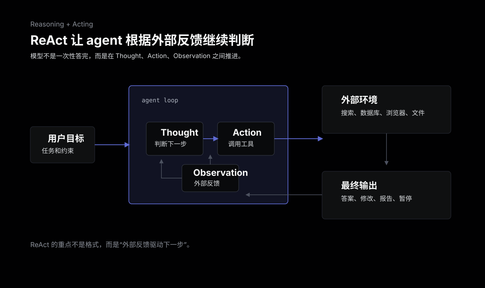
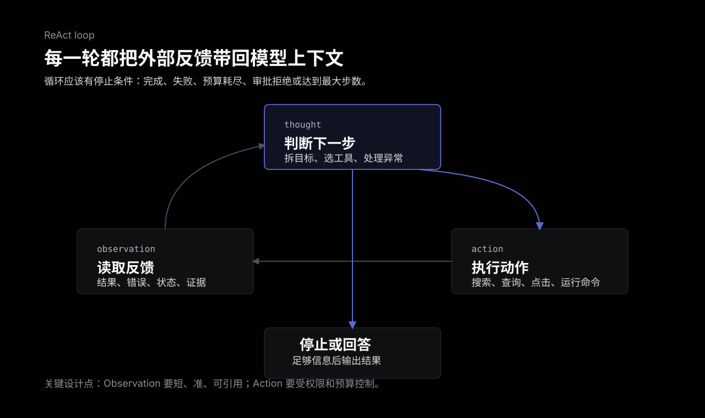
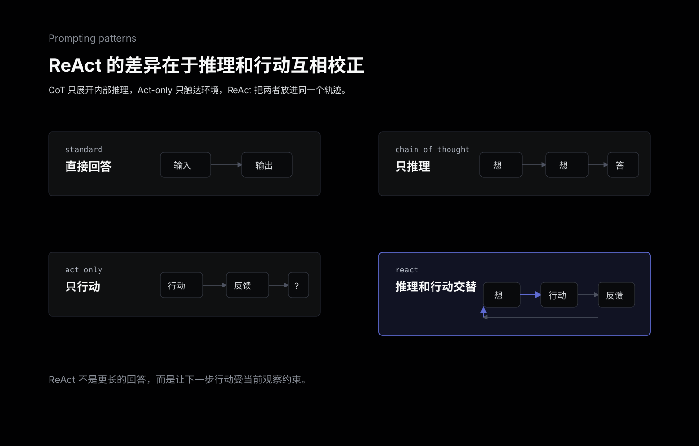
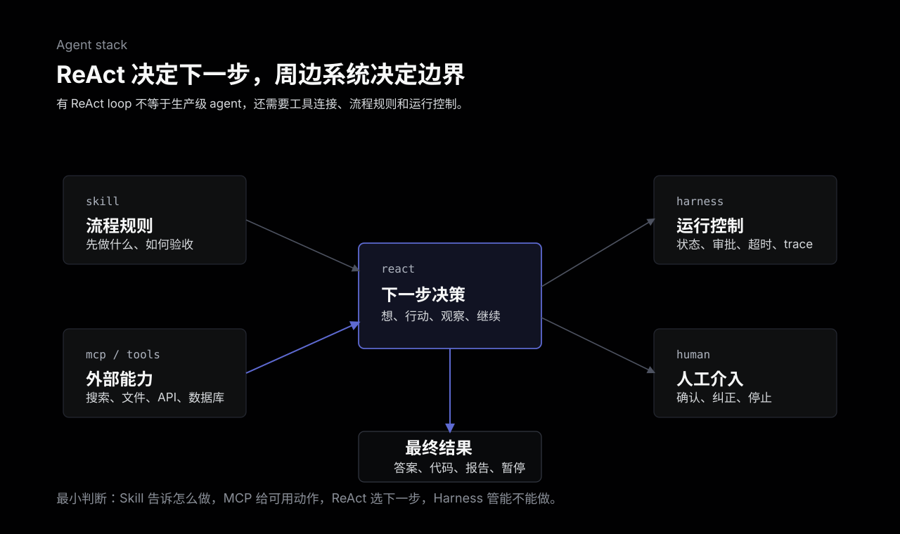

Agent ReAct 里的 ReAct 不是前端框架 React，而是 Reasoning + Acting。它解决的是一个很具体的问题：当模型只靠内部知识不够用、必须和外部环境交互时，应该怎样把“思考下一步”和“执行动作”组织成一个可持续的循环。

一句话概括：

> ReAct 是一种 agent 行动模式：模型先判断当前缺什么信息，再调用工具或环境，拿到 observation 后继续调整下一步。

它不是某个模型能力，也不是某个框架独占的 API。ReAct 更像一个控制流程模板。早期论文里常见写法是 `Thought -> Action -> Observation` 反复出现；到了现代工具调用 API 里，`Action` 往往变成结构化 tool call，`Observation` 变成 tool result，而 `Thought` 可以是内部推理、简短计划或给系统看的 trace。



## 从只回答问题开始

最简单的模型调用只有一条线：

```text
用户问题 -> 模型回答
```

如果问题只需要写作、总结、改写，或者答案已经在上下文里，这样就够了。模型不需要行动，也不需要多轮探索。

麻烦出现在另一类任务里：

- 问题需要查资料，模型内部知识可能过期。
- 需要多跳推理，前一步结果会影响下一步查询。
- 要操作外部系统，比如网页、数据库、代码仓库、文件系统。
- 环境会返回反馈，模型必须根据反馈调整计划。
- 一次工具调用不够，需要边做边修正。

比如问一个多跳事实问题：先查一个人属于哪家公司，再查这家公司最近的某个事件，最后把两者合起来回答。模型如果只靠一次生成，很容易把中间事实补错。更稳的做法是：先想要查什么，再查，看到结果后决定下一步。

ReAct 把这个过程显式化。

## ReAct 的基本循环

一个经典 ReAct 轨迹通常包含三类片段：

**Thought**

模型根据当前任务和已有观察，判断下一步应该做什么。它可以是拆解目标、选择工具、记录中间事实、处理异常，也可以是决定已经足够回答。

**Action**

模型选择一个动作。动作可以是搜索、打开网页、查询数据库、读取文件、调用 API、执行代码，也可以是某个环境里的移动、点击、选择。

**Observation**

外部环境返回结果。它可能是一段网页内容、一条 SQL 结果、一段日志、一个错误信息、一个工具调用返回值，或者浏览器当前状态。

然后模型把 observation 放回上下文，继续下一轮 Thought。



这个结构的关键不是把三个词写出来，而是控制权发生了变化。模型不再一次性把答案编完，而是在外部反馈里逐步推进。每一步都可以被记录、检查、限制和中断。

## 和 CoT、Act-only 的区别

ReAct 容易和 Chain-of-Thought 混在一起，因为它也有“思考”。但两者解决的问题不同。

Chain-of-Thought 偏向让模型展开内部推理。它适合数学、逻辑、常识推理这类可以靠上下文和模型内部知识完成的任务。它的问题是，推理链如果从一开始就建立在错误事实上，后面会很自然地错下去。

Act-only 偏向让模型直接选择动作。它适合动作空间清楚、环境反馈强的任务，但如果没有显式目标分解和状态记录，模型容易变成“看到什么点什么”，长任务里很难保持计划。

ReAct 把两者接在一起：reasoning 帮 action 找方向，action 又把外部 observation 带回 reasoning。



可以粗略这样区分：

| 模式 | 核心动作 | 适合场景 | 主要风险 |
| --- | --- | --- | --- |
| Standard | 直接回答 | 简单问答、改写、总结 | 缺事实时硬答 |
| CoT | 只推理 | 数学、逻辑、多步文本推理 | 推理建立在错误事实上 |
| Act-only | 只行动 | 简单环境操作 | 缺少计划和中间状态 |
| ReAct | 推理和行动交替 | 工具调用、多跳查询、交互任务 | 循环失控、工具误用 |

这里有一个现实边界：生产系统里不一定要把模型的完整内部推理原文暴露给用户。ReAct 的价值在于“推理和行动交替”的控制模式，不在于把每个私有思考 token 都展示出来。很多系统会把 `Thought` 压成简短计划、决策理由或结构化 trace，只把必要信息展示给开发者、审计系统或用户。

## ReAct 为什么对 agent 有用

ReAct 适合 agent，是因为 agent 的问题通常不是“回答一句话”，而是“在不完整信息里完成一个目标”。

它至少带来四个好处。

第一，降低纯内部推理的幻觉风险。模型可以通过搜索、数据库、文件、计算器等外部工具拿到 observation，而不是一直在自己的参数里猜。

第二，让多步任务可追踪。每一轮 action 和 observation 都能被记录下来。出了问题时，可以看是目标拆错、工具选错、参数错、工具结果错，还是最终总结错。

第三，支持动态调整。真实任务经常不是一条固定 pipeline。工具报错、搜索结果不够、网页结构变化、测试失败，都需要 agent 修改下一步计划。

第四，方便人类介入。因为轨迹有结构，人可以在某一步暂停、审批、改写计划、限制工具，或者直接纠正某个错误观察。

这些好处不是免费的。ReAct 会增加调用次数、延迟、成本和运行风险。一个需要一次模型调用就能完成的任务，硬套 ReAct 只会变慢。

## 现代工具调用里的 ReAct

早期 ReAct prompt 里，动作常常写成文本格式：

```text
Thought: 我需要先查订单状态。
Action: get_order_status(order_id="123")
Observation: 订单已发货。
Thought: 现在可以回答用户。
Final Answer: ...
```

现代模型 API 和 agent 框架里，通常不再让模型手写这种字符串动作，而是使用结构化 tool calling：

- 模型输出 tool name 和 JSON 参数。
- 系统执行工具。
- 工具结果作为 tool message 回到上下文。
- 模型继续生成下一步，直到不再请求工具。

这仍然可以是 ReAct，只是 `Action` 的载体变了。真正重要的是这个闭环：

```text
模型判断 -> 工具调用 -> 外部反馈 -> 模型继续判断
```

LangGraph、LangChain 这类框架里的 ReAct-style agent，本质上也是这个循环：模型节点调用工具，工具结果回到 messages，模型再决定是否继续。

## 和 MCP、Skill、Harness 的关系

ReAct 经常和 MCP、Skill、Agent Harness 一起出现，但它们不是同一层。

| 概念 | 主要解决的问题 | 和 ReAct 的关系 |
| --- | --- | --- |
| ReAct | 模型如何交替推理和行动 | 决定下一步是想、调用工具，还是结束 |
| MCP | 外部工具和资源如何标准化连接 | 给 ReAct 的 Action 提供可调用能力 |
| Skill | 某类任务应该按什么流程和规则执行 | 给 ReAct 提供任务级操作手册 |
| Harness | loop、状态、权限、审批、观测如何运行 | 控制 ReAct 循环不要越界 |



举个例子：让 agent 给一个仓库修 bug。

- Skill 规定：先读 issue，再复现，再改代码，再跑测试，最后总结。
- MCP 或工具层提供：读 GitHub、读文件、运行测试、创建 PR。
- ReAct 决定：现在先读哪个文件，测试失败后下一步查什么。
- Harness 控制：最多循环多少次，哪些命令需要确认，如何记录 trace，什么时候停止。

所以不要把 ReAct 理解成“有了它就有 agent”。ReAct 只是 agent 行动模式的一部分。没有工具，它只能空转；没有 harness，它容易失控；没有 skill，它可能不知道某类任务的正确流程。

## 什么时候需要 ReAct

适合使用 ReAct 的任务通常有这些特征：

- 需要根据外部信息逐步推进。
- 下一步动作依赖上一步 observation。
- 工具有多个，模型需要选择。
- 任务可能失败，需要调整计划。
- 需要留下可调试的行动轨迹。
- 人类可能在中途审批或纠正。

常见场景包括：

- 多跳问答和事实核查。
- RAG 检索后还要继续追问或补查。
- 浏览器操作、网页导航、在线表单。
- 代码排障：读日志、搜代码、改文件、跑测试。
- 数据分析：查 schema、写查询、看结果、修 SQL。
- 内部工具 agent：查工单、查订单、改状态、写摘要。

不适合的场景也很明确：

- 一次生成就够的写作、摘要、翻译。
- 线性且确定的业务流程，用普通代码更清楚。
- 工具都是高风险副作用，但没有审批系统。
- 成本和延迟非常敏感，不允许多轮调用。
- 模型不稳定，连工具参数都经常填错。

ReAct 的判断标准不是“任务听起来像 agent”，而是“是否需要外部反馈驱动下一步”。

## 常见失败模式

ReAct 能降低一部分幻觉，但不会自动可靠。

**循环停不下来**

模型一直觉得“还需要再查一下”，结果不断调用工具。必须有最大步数、时间预算、成本预算和明确停止条件。

**工具选错或参数错**

工具描述不清、schema 太复杂、同类工具太多，都会让模型选错。工具越多，越需要分组、白名单和清晰描述。

**观察结果被误读**

Observation 只是外部反馈，不等于真相。搜索结果可能过时，网页可能被 prompt injection 污染，数据库结果可能被权限过滤。模型仍然可能把错误 observation 当成可靠事实。

**推理轨迹过长**

每一轮 Thought/Action/Observation 都进入上下文，很容易变噪声。长任务需要压缩历史、保留关键状态，而不是把所有过程无限堆进去。

**副作用失控**

只要 action 能写文件、发消息、改数据、下订单，ReAct 就不能只靠 prompt 约束。高风险动作必须有人类确认、权限隔离和审计。

## 一个实用的设计顺序

实现 ReAct-style agent 时，可以按这个顺序收紧边界：

1. 先定义任务是否真的需要多轮外部反馈。
2. 把 action 限定在少量清楚工具里，不要一开始暴露全工具箱。
3. 给每个工具写清楚输入 schema、返回结构和失败信息。
4. 让 observation 尽量短、结构化、可引用。
5. 设置最大步数、超时、成本预算和停止条件。
6. 对写入型工具加入审批和审计。
7. 记录每一步 tool call、参数、结果和最终答案。
8. 用固定评估样例检查：工具是否选对、参数是否正确、是否过度调用、最终答案是否引用了观察结果。

真正难的不是写出 `Thought / Action / Observation` 三个词，而是让循环在真实系统里可控、可停、可调试、可恢复。

## 总结

ReAct 是 agent 的一种基础行动模式：模型通过推理决定下一步，通过 action 接触外部环境，再用 observation 更新判断。

它的价值在于把“内部推理”和“外部反馈”接起来。CoT 让模型想得更展开，tool calling 让模型能调用工具，ReAct 则把两者组织成多轮闭环。

但 ReAct 不是完整生产方案。它需要 MCP 或工具层提供外部能力，需要 Skill 提供任务流程，需要 Harness 控制权限、状态、审批、观测和停止条件。用得好，它能让 agent 少猜、多查、可追踪；用得重，它也会带来循环、成本、延迟和副作用风险。

## 参考

- [ReAct: Synergizing Reasoning and Acting in Language Models](https://arxiv.org/abs/2210.03629)
- [ReAct project site](https://react-lm.github.io/)
- [ReAct: Synergizing Reasoning and Acting in Language Models | Google Research](https://research.google/blog/react-synergizing-reasoning-and-acting-in-language-models/)
- [LangGraph prebuilt create_react_agent reference](https://reference.langchain.com/python/langgraph.prebuilt/chat_agent_executor/create_react_agent)
- [LangChain v1 migration guide](https://docs.langchain.com/oss/python/migrate/langchain-v1)
