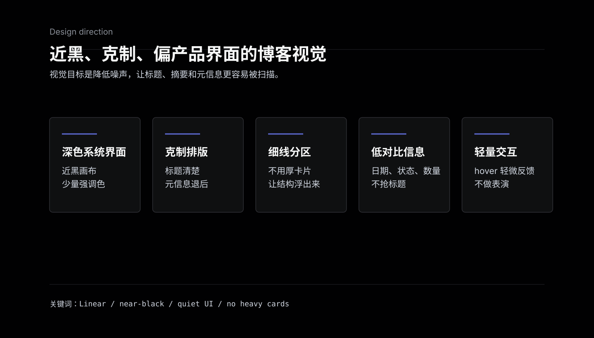
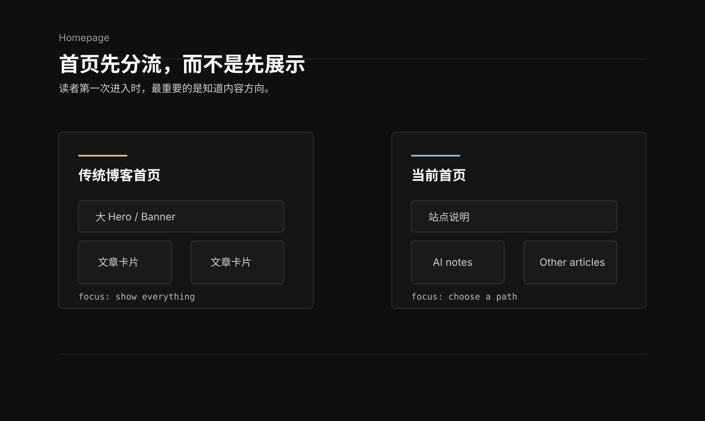
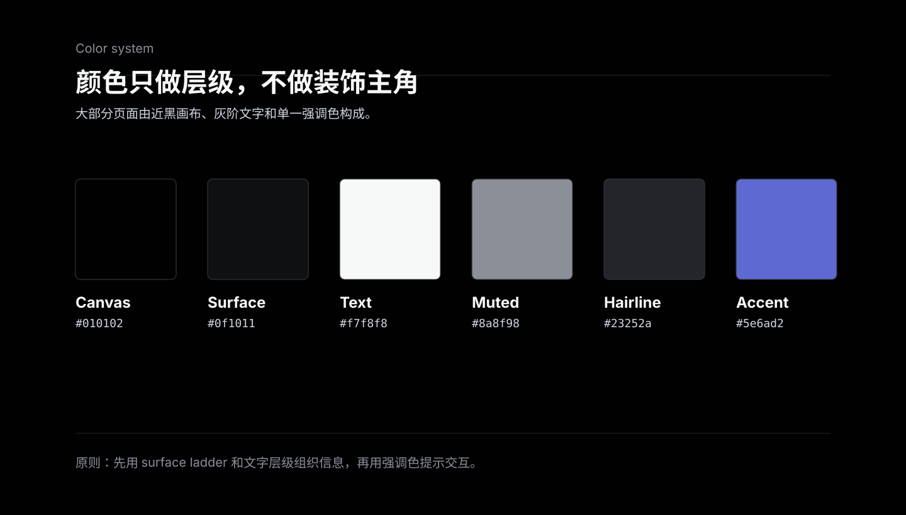
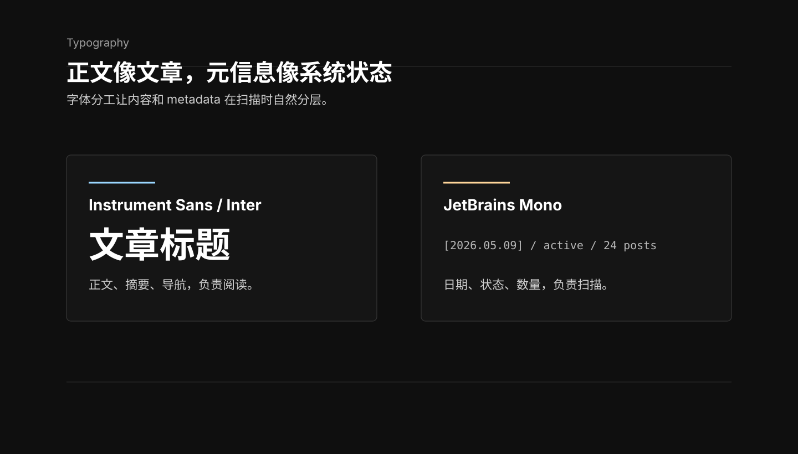
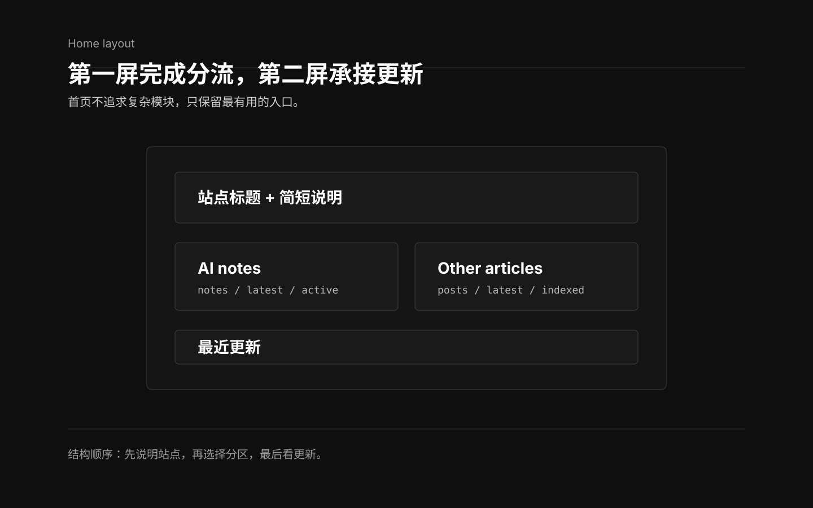
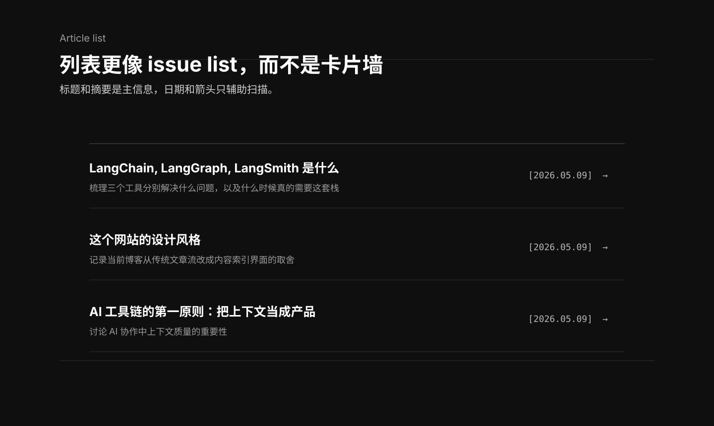
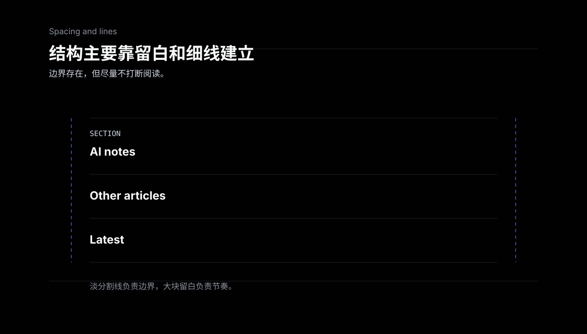
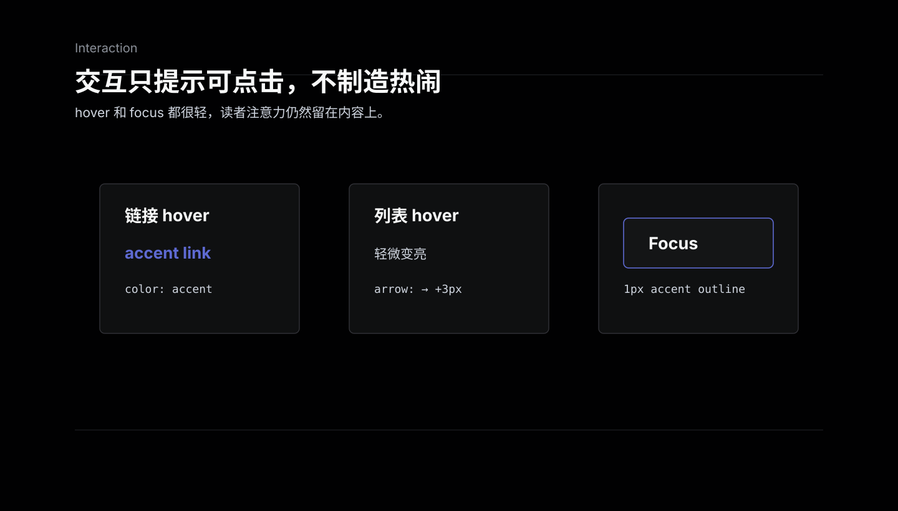
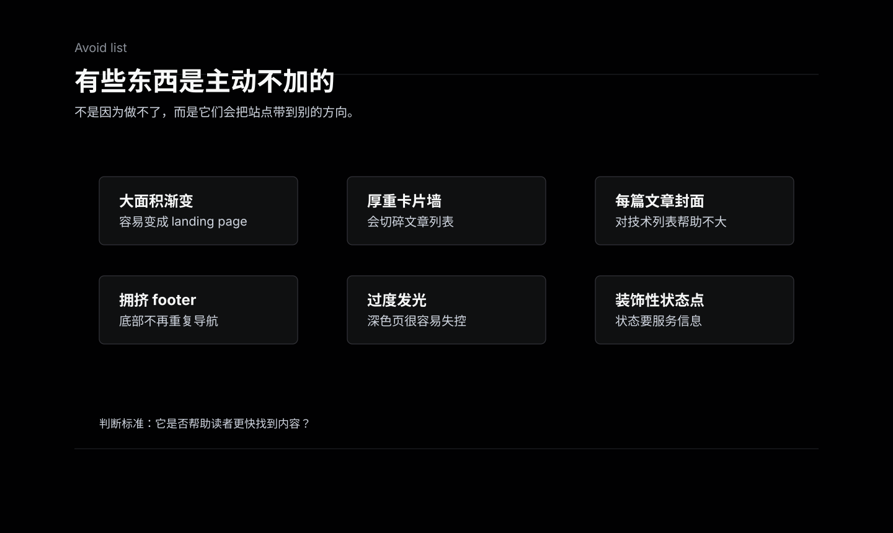
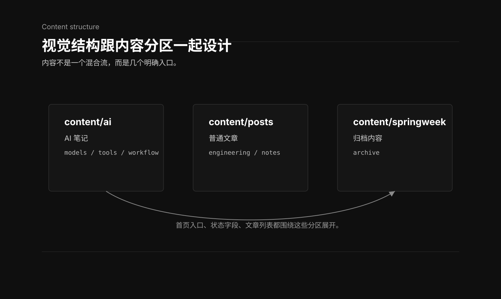

最近给这个博客做了一次视觉调整。它还是一个 Hugo 博客，内容也还是技术文章、AI 笔记和一些旧笔记，但我不太想让它继续像一个传统博客首页：上面一个大 banner，下面一堆带封面的文章卡片，footer 再堆一些导航链接。

这次我想要的方向更接近 Linear / Craft 那类产品界面：深色、克制、信息密度更高，主要靠排版、细线、留白和状态字段组织内容。

简单说，这个网站现在不是在做“展示型首页”，而是在做一个“个人内容索引界面”。



## 为什么改成这种风格

博客默认主题通常会把每篇文章当成一个内容卡片：标题、摘要、日期、封面、标签全部塞进去。这种方式很直观，但文章多了之后，很容易变成一个信息噪声很大的列表。

我这个博客里内容类型比较混杂：

- 旧的 Java / Spring / Go 技术笔记。
- 一些翻译文章。
- 新增的 AI 工具链和工作流笔记。
- 未来可能还会有更多专题分区。

如果所有内容都放进同一个传统文章流里，读者第一次进来时不太容易判断应该看哪里。所以首页的目标不是“展示最新文章”，而是先回答一个问题：你想进入哪个内容方向？

这也是为什么现在首页会先给两个入口：AI notes 和 Other articles。它更像一个控制台，而不是一张海报。



## 颜色：黑底白字，不靠大面积渐变

主背景固定在 `#111111` 附近，主文字是白色，辅助文字用不同透明度的白色来做层级。

现在主要颜色大概是这样：

- 背景：`#111111`
- 主文字：`#FFFFFF`
- 次级文字：`rgba(255,255,255,0.62)`
- 弱信息：`rgba(255,255,255,0.38)`
- 分割线：`rgba(255,255,255,0.08)`
- 少量强调色：青色、粉色、橙色

这套颜色的重点不是“酷”，而是让页面退到后面，让内容和结构浮出来。深色背景如果配太多霓虹、渐变和发光，很快就会变成游戏 UI 或活动页。这里保留一点点 cyan / pink，只作为 hover、focus、状态点缀，不作为主体视觉。



## 排版：用字体层级区分内容层级

字体上主要分两类：

- `Instrument Sans` / `Inter`：正文、标题、导航。
- `JetBrains Mono`：日期、状态、eyebrow、小型元信息。

这个选择其实是为了把“内容”和“状态”分开。

文章标题、摘要、正文还是正常无衬线字体，读起来比较轻。日期、section 状态、数量、latest 这类信息使用等宽字体，会更像系统界面里的 metadata。

比如首页不是写一大段“这里有多少篇 AI 文章，最近更新于哪天”，而是做成：

```text
3 notes / 2026.05.09 / active
```

这种写法少解释一点，但扫描效率更高。



## 首页：第一屏先做选择

首页现在的结构很简单：

1. 顶部是站点标题和一句说明。
2. 中间是两个主要入口：AI notes 和 Other articles。
3. 下面才是最近更新。

这样做有个好处：第一次访问的人不用先理解整个博客历史，只需要选一个方向。熟悉的人则可以直接往下看最近更新。

我也刻意没有在首页放很重的 hero。个人博客如果用了太大的 hero，很容易变成“欢迎来到我的网站”式的页面，但真正有用的信息反而被推到下面。现在首页的第一屏要完成的是分流，不是表演。



## 文章列表：不要每篇文章一个卡片

文章列表是这次调整里很关键的一点。

我不希望列表里每一篇文章都是一个独立背景卡片。卡片太多以后，页面会被一堆边框、阴影和圆角切碎。现在列表更接近任务列表或 issue list：

- 每篇文章只占一行或一块轻量区域。
- 用底部分割线区分条目。
- 标题是主信息。
- 摘要是次信息。
- 日期靠右，用等宽字体。
- hover 时只做轻微亮度和箭头位移。

这种方式更适合技术博客。因为读者浏览文章列表时，主要是在找标题和主题，不是在看封面。



## 留白和细线：让页面像一个系统界面

这个风格里最常用的元素不是按钮，也不是图标，而是细线。

细线主要做三件事：

- 分隔 section。
- 建立阅读节奏。
- 给信息一个边界，但不打断页面。

比如首页两个入口之间用竖线分隔，最近更新上方用横线分隔，文章列表每个条目用底线分隔。这些线都很淡，存在感不强，但足够让读者知道内容块之间的关系。

留白也是一样。这里不是追求“空”，而是让每个信息块有足够的呼吸空间。尤其是深色页面，如果元素贴得太近，会显得很压。



## 交互：轻，不抢内容

交互上我没有做复杂动效，只保留几类很轻的反馈：

- 链接 hover 变成 cyan，并有很弱的 glow。
- 列表项 hover 轻微上移或变亮。
- 箭头 hover 时向右移动一点。
- focus 状态有细的 cyan outline。

这些反馈的目的只是告诉用户“这里可以点”，不是让页面变得热闹。

我觉得个人博客的交互应该像编辑器或文档工具：存在，但不抢。读者真正花时间看的还是文章。



## 我刻意避免的东西

这次设计里有一些东西是主动避开的：

- 不做大面积渐变背景。
- 不做很多毛玻璃卡片。
- 不给每篇文章配封面图。
- 不在 footer 堆导航。
- 不用绿色状态点做“在线感”。
- 不做过度圆角和厚重阴影。

这些东西不是不能用，而是很容易把个人技术博客带到另一种方向：要么像 SaaS landing page，要么像作品集首页，要么像 dashboard 模板。这个网站目前更适合保持成一个安静的内容系统。



## 和内容结构的关系

视觉风格不是单独存在的，它服务于内容结构。

现在这个站点的内容分区比较明确：

- `content/ai/`：AI 笔记，放模型、工具链、上下文工程、工作流观察。
- `content/posts/`：普通文章，放工程实践、问题排查、翻译和旧笔记。
- `content/springweek/`：更早的 Spring 周报归档。

所以页面设计也跟着变成“分区入口 + 状态字段 + 文章流”。如果以后 AI 文章越来越多，或者再加新的专题分区，这套布局也能继续扩展，不需要推翻重做。



## 总结

这个网站现在的设计目标可以概括成一句话：用产品界面的方式组织个人技术内容。

它不是传统博客的封面流，也不是营销站的视觉展示，而是一个深色、安静、偏系统感的内容索引。颜色尽量少，卡片尽量少，重点放在排版层级、细线分区、低对比元信息和轻量交互上。

后面如果继续调整，我觉得也应该沿着这个方向走：不要为了“更丰富”而加装饰，而是让读者更快知道有哪些内容、内容属于哪里、下一步应该点哪里。

