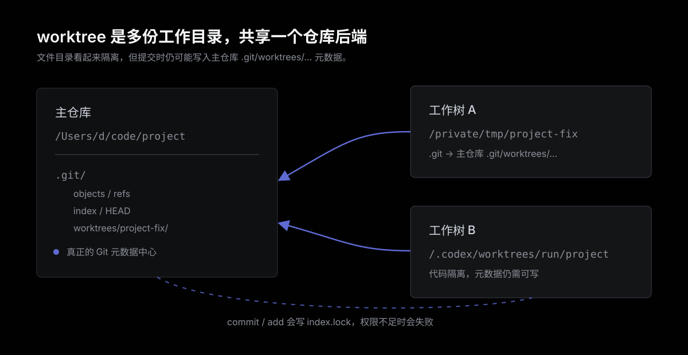

`git worktree` 解决的是一个很具体的问题：同一个仓库，想同时有多份可以编辑的工作目录，而不想每次都重新 clone 一份完整仓库。

它看起来像一个独立项目目录，但本质上不是完整副本。worktree 共享同一个仓库后端，只是多了一份前台工作目录。这一点很重要，因为很多“为什么我明明在临时目录里改代码，却还是卡在主仓库 `.git` 里”的问题，都来自这里。

一句话概括：

```text
worktree 是共享同一个 Git 仓库后端的多份前端工作目录。
```



## 从普通仓库开始

最常见的 Git 仓库结构很简单：

```text
/Users/d/code/project
├── .git/
├── app/
├── package.json
└── README.md
```

这里 `.git/` 是真正的仓库后端，里面保存提交对象、分支引用、索引、锁文件等元数据。工作目录里的文件是你正在编辑的内容。

平时执行这些命令：

```bash
git status
git add .
git commit -m "Update"
```

Git 既会读取工作目录里的文件，也会写 `.git/` 里的索引和元数据。

## worktree 多出来的是什么

`git worktree` 允许同一个仓库额外挂出另一个工作目录，例如：

```bash
git worktree add /private/tmp/project-fix feature/fix
```

这时会出现一个新的目录：

```text
/private/tmp/project-fix
├── .git
├── app/
├── package.json
└── README.md
```

注意这里的 `.git` 通常不是一个目录，而是一个文本文件，里面指向主仓库下面的 worktree 元数据：

```text
gitdir: /Users/d/code/project/.git/worktrees/project-fix
```

也就是说，代码文件在 `/private/tmp/project-fix`，但 Git 需要写入的索引、HEAD、锁文件等内容，仍然挂在主仓库的 `.git/worktrees/...` 下面。

## 它和 clone 的区别

普通 clone 是完整复制一份仓库：

```text
/tmp/project-copy
└── .git/
```

这份 clone 有自己的 `.git/`，提交时写自己的索引和锁文件。它和原仓库之间只通过 remote 同步。

worktree 不是这样。worktree 更像同一个仓库伸出去的另一只手：

```text
/Users/d/code/project/.git/
├── objects/
├── refs/
└── worktrees/
    └── project-fix/
```

不同 worktree 可以有不同工作目录、不同 HEAD、不同索引，但底层对象库和主仓库关系仍然绑在一起。

这就是它高效的地方：不用重新 clone，不用复制完整历史，切换和并行开发都很快。

这也是它容易误判的地方：目录看起来隔离了，但 Git 元数据没有完全隔离。

## 什么时候适合用 worktree

worktree 适合这些场景：

- 同时处理两个分支，不想频繁 stash 或切分支。
- 一个目录跑长期 dev server，另一个目录临时修 bug。
- 自动化任务需要一份临时工作目录，避免直接污染用户当前 checkout。
- 大仓库 clone 成本高，只想复用本地对象库。

例如：

```bash
git worktree add ../project-review origin/main
git worktree add ../project-hotfix hotfix/login
```

这样可以同时保留多个分支的文件状态，互不覆盖工作目录。

## 为什么自动化会被 index.lock 卡住

这类错误一般长这样：

```text
fatal: Unable to create '/Users/d/code/project/.git/worktrees/project-fix/index.lock': Operation not permitted
```

表面上看，自动化正在 `/private/tmp/project-fix` 或 `.codex/worktrees/...` 这样的临时目录里工作。直觉上会以为只要这个临时目录可写，就能提交。

但 worktree 的提交路径不是只写临时目录。执行 `git add` 时，Git 要更新这个 worktree 对应的 index，也就是主仓库 `.git/worktrees/project-fix/index`。为了避免并发写坏索引，Git 会先创建 `index.lock`。

如果运行环境只能写临时工作目录，不能写主仓库 `.git/worktrees/...`，提交就会失败。

这不是文件内容冲突，而是 Git 元数据写权限问题。

## 怎么判断当前目录是不是 worktree

可以看 `.git`：

```bash
cat .git
```

如果输出类似这样：

```text
gitdir: /Users/d/code/project/.git/worktrees/project-fix
```

当前目录就是 worktree。

也可以看 Git 自己解析出来的路径：

```bash
git rev-parse --git-dir
git rev-parse --git-common-dir
```

如果 `--git-dir` 指向 `.git/worktrees/...`，而 `--git-common-dir` 指向主仓库 `.git`，说明它不是完全独立 clone。

## 怎么避免自动化被卡住

如果自动化只需要读文件、跑测试、生成 diff，worktree 很合适。

如果自动化还要自己 `commit` 和 `push`，要先确认两件事：

- worktree 的 `git-dir` 可写。
- 主仓库的 `.git/worktrees/...` 可写。

更稳的做法是：把 worktree 当成读写文件的隔离层，把最终提交放到临时独立 clone 里做。

流程可以是：

```text
1. 在 worktree 中完成修改和验证
2. 如果 git 元数据不可写，创建 /private/tmp 下的临时 clone
3. 只把本次相关文件同步到临时 clone
4. 在临时 clone 中 commit / push
```

这样提交时写的是临时 clone 自己的 `.git/`，不会碰主仓库 `.git/worktrees/.../index.lock`。

## 总结

worktree 的价值是让同一个仓库拥有多份工作目录，适合并行开发、临时检查和自动化隔离。

但它不是完整 clone。它隔离了工作目录，没有完全隔离 Git 元数据。只要提交路径还要写主仓库 `.git/worktrees/...`，权限、锁文件和并发状态就仍然会影响它。

判断 worktree 时不要只看“文件是不是在临时目录”。真正要看的是：

```bash
git rev-parse --git-dir
git rev-parse --git-common-dir
```

如果要让自动化稳定提交，worktree 之外最好准备一条独立 clone 的 fallback 路径。

## 参考

- `git help worktree`
- `git help rev-parse`
