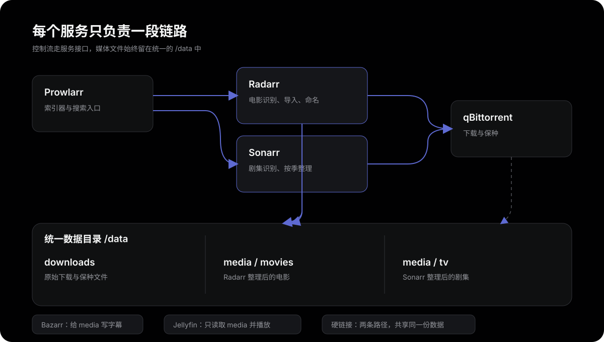
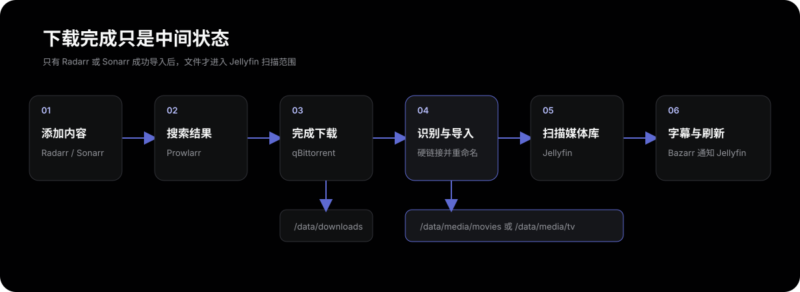

NAS 上装好 Jellyfin 并不等于影视库已经搭好。真正省事的状态是：搜索内容后，下载器负责下载，Radarr 或 Sonarr 识别并整理文件，Bazarr 补字幕，最后 Jellyfin 自动刷新媒体库。

这套流程里最容易出错的不是某个按钮，而是容器路径。只要 qBittorrent、Radarr、Sonarr 和 Bazarr 看到的路径不一致，就会出现“下载完成但没有导入”“文件进了媒体目录但没有重命名”“字幕找到了却写不进去”等问题。

最终采用的原则只有三个：

1. 所有服务都由同一个 Docker Compose 项目管理。
2. 下载目录和媒体目录位于同一块文件系统，并统一挂载为容器内的 `/data`。
3. 电影和电视剧分库管理，不使用混合媒体库。

本文只讨论个人拥有或已获授权内容的整理与播放。索引器和下载器应遵守所在地区法律及站点规则。

## 整体架构

这套服务各自只做一件事：

- qBittorrent：执行下载和保种。
- Radarr：管理电影，选择资源并在下载完成后整理、重命名。
- Sonarr：管理电视剧，按季和集整理、重命名。
- Prowlarr：集中管理索引器，把搜索能力同步给 Radarr 和 Sonarr。
- Bazarr：根据 Radarr、Sonarr 中的媒体自动查找和管理字幕。
- Jellyfin：扫描最终媒体目录，提供海报墙和播放服务。



Jellyfin 不应该直接扫描下载目录。下载目录里可能有未完成文件、样片、广告图片和混乱的发布名；只有经过 Radarr 或 Sonarr 整理后的文件，才进入 Jellyfin 的媒体库。

## 目录结构

先在 fnOS 的数据盘建立两棵目录。以下路径以 `/vol1/1000` 为例，实际安装时要换成自己的存储空间路径。

```text
/vol1/1000/
├── appdata/
│   └── media-stack/
│       ├── qbittorrent/
│       ├── radarr/
│       ├── sonarr/
│       ├── prowlarr/
│       ├── bazarr/
│       └── jellyfin/
└── data/
    ├── downloads/
    │   ├── incomplete/
    │   └── complete/
    │       ├── movies/
    │       └── tv/
    └── media/
        ├── movies/
        └── tv/
```

`appdata` 保存容器配置，适合放在 SSD；`data` 保存下载和最终媒体，通常放在大容量硬盘。

这里没有把宿主机的电影目录映射成 `/movies`，再把下载目录映射成 `/downloads`。虽然这样看起来直观，但 Docker 会把它们视为两个挂载点，Radarr 和 Sonarr 很可能无法使用硬链接，只能复制大文件。

统一挂载成 `/data` 后，所有服务看到的路径都一致：

```text
宿主机 /vol1/1000/data/downloads  -> 容器 /data/downloads
宿主机 /vol1/1000/data/media      -> 容器 /data/media
```

下载和媒体目录还必须处于同一文件系统。硬链接不能跨磁盘、分区或存储卷。如果下载目录在 SSD、媒体目录在机械盘，即使容器路径统一，也只能复制。

## 创建 Docker Compose 项目

在 fnOS 的 Docker 应用中创建 Compose 项目，项目路径选择：

```text
/vol1/1000/appdata/media-stack
```

然后使用下面的 `docker-compose.yml`。先确认宿主机路径、用户 ID、组 ID 和端口没有冲突，再启动项目。

```yaml
name: media-stack

x-common-env: &common-env
  PUID: "1000"
  PGID: "100"
  TZ: Asia/Shanghai
  UMASK: "002"

services:
  qbittorrent:
    image: lscr.io/linuxserver/qbittorrent:latest
    container_name: qbittorrent
    restart: unless-stopped
    environment:
      <<: *common-env
      WEBUI_PORT: "8080"
      TORRENTING_PORT: "6881"
    volumes:
      - /vol1/1000/appdata/media-stack/qbittorrent:/config
      - /vol1/1000/data:/data
    ports:
      - "8080:8080"
      - "6881:6881"
      - "6881:6881/udp"

  radarr:
    image: lscr.io/linuxserver/radarr:latest
    container_name: radarr
    restart: unless-stopped
    environment: *common-env
    volumes:
      - /vol1/1000/appdata/media-stack/radarr:/config
      - /vol1/1000/data:/data
    ports:
      - "7878:7878"

  sonarr:
    image: lscr.io/linuxserver/sonarr:latest
    container_name: sonarr
    restart: unless-stopped
    environment: *common-env
    volumes:
      - /vol1/1000/appdata/media-stack/sonarr:/config
      - /vol1/1000/data:/data
    ports:
      - "8989:8989"

  prowlarr:
    image: lscr.io/linuxserver/prowlarr:latest
    container_name: prowlarr
    restart: unless-stopped
    environment: *common-env
    volumes:
      - /vol1/1000/appdata/media-stack/prowlarr:/config
    ports:
      - "9696:9696"

  bazarr:
    image: lscr.io/linuxserver/bazarr:latest
    container_name: bazarr
    restart: unless-stopped
    environment: *common-env
    volumes:
      - /vol1/1000/appdata/media-stack/bazarr:/config
      - /vol1/1000/data:/data
    ports:
      - "6767:6767"

  jellyfin:
    image: lscr.io/linuxserver/jellyfin:latest
    container_name: jellyfin
    restart: unless-stopped
    environment: *common-env
    volumes:
      - /vol1/1000/appdata/media-stack/jellyfin:/config
      - /vol1/1000/data/media:/data/media:ro
    devices:
      - /dev/dri:/dev/dri
    ports:
      - "8096:8096"
```

这份配置没有映射 Jellyfin 的 `7359/udp`。它只用于局域网发现，不影响通过 `8096` 访问，而且 fnOS 上很容易与旧 Jellyfin 实例冲突。需要自动发现时再单独添加。

如果 NAS 没有 `/dev/dri`，说明没有可传递的核显设备，应删除 `devices` 部分，否则 Jellyfin 容器可能无法启动。

启动后，在同一局域网中访问：

| 服务 | 地址 |
| --- | --- |
| qBittorrent | `http://NAS_IP:8080` |
| Radarr | `http://NAS_IP:7878` |
| Sonarr | `http://NAS_IP:8989` |
| Prowlarr | `http://NAS_IP:9696` |
| Bazarr | `http://NAS_IP:6767` |
| Jellyfin | `http://NAS_IP:8096` |

容器之间不要使用 NAS 的局域网 IP，而要直接使用 Compose 服务名，例如 `http://qbittorrent:8080`。这样不依赖路由器地址，也不需要把流量绕出 Docker 网络。

## 设置 qBittorrent

首次启动时，用户名通常是 `admin`，临时密码会写在 qBittorrent 容器日志中。进入 Web UI 后先修改管理员密码，然后在“选项 → 下载”中设置：

```text
默认保存路径：/data/downloads/complete
未完成保存路径：/data/downloads/incomplete
```

创建两个分类：

```text
radarr  -> /data/downloads/complete/movies
sonarr  -> /data/downloads/complete/tv
```

分类不只是为了界面整齐。Radarr 和 Sonarr 会用分类判断哪些任务属于自己，避免电影管理器误处理电视剧下载。

下载完成后不要让 qBittorrent 自动移动到媒体库，也不要用外部脚本重命名。它只负责保持原始下载文件，整理工作交给 Radarr 和 Sonarr。

## 设置 Radarr

### 添加 qBittorrent

进入：

```text
Settings -> Download Clients -> Add -> qBittorrent
```

填写：

```text
Host：qbittorrent
Port：8080
Username：qBittorrent 管理员用户名
Password：qBittorrent 管理员密码
Category：radarr
```

测试成功后保存。`Completed Download Handling` 保持开启。

因为 Radarr 和 qBittorrent 都把宿主机数据目录映射为 `/data`，不需要配置 `Remote Path Mapping`。只有两边看到的路径确实不同，才需要远程路径映射。

### 设置根目录

添加电影时使用：

```text
/data/media/movies
```

不要把 `/data/downloads/complete` 设成媒体根目录，也不要让 Jellyfin 扫描它。

### 设置重命名

进入：

```text
Settings -> Media Management
```

开启 `Rename Movies` 和 `Replace Illegal Characters`，推荐的目录格式：

```text
{Movie CleanTitle} ({Release Year}) [tmdbid-{TmdbId}]
```

文件格式可以从简单方案开始：

```text
{Movie CleanTitle} ({Release Year}) [tmdbid-{TmdbId}] - {Quality Full}
```

最终目录类似：

```text
/data/media/movies/
└── Example Movie (2024) [tmdbid-123456]/
    └── Example Movie (2024) [tmdbid-123456] - Remux-2160p.mkv
```

TMDB ID 能显著降低 Jellyfin 误识别。修改命名规则只影响之后导入的文件，旧电影不会自动改名。已有内容需要在 Radarr 的电影编辑或预览重命名页面执行 `Rename Files`。

### 开启硬链接

在媒体管理的导入设置中开启：

```text
Use Hardlinks instead of Copy
```

对于需要继续做种的任务，Radarr 会在媒体目录建立一个新的文件名，但底层仍指向同一份数据。看起来下载目录和媒体目录各有一份，实际不会占用双倍空间。

## 设置 Sonarr

Sonarr 的配置与 Radarr 基本相同：

```text
下载客户端 Host：qbittorrent
下载客户端 Port：8080
Category：sonarr
根目录：/data/media/tv
```

推荐开启剧集重命名，并采用清晰的季、集结构：

```text
Series Folder：{Series TitleYear} [tvdbid-{TvdbId}]
Season Folder：Season {season:00}
Episode File：{Series TitleYear} - S{season:00}E{episode:00} - {Episode CleanTitle} [{Quality Full}]
```

最终结构类似：

```text
/data/media/tv/
└── Example Series (2024) [tvdbid-123456]/
    └── Season 02/
        └── Example Series (2024) - S02E01 - Episode Title [WEBDL-2160p].mkv
```

电视剧发布名经常简写或省略年份。如果活动队列显示 `Series title mismatch`，说明 Sonarr 无法确认下载项属于哪部剧。先检查任务是不是由 Sonarr 发起、分类是不是 `sonarr`，再打开交互式导入手动匹配一次。不要直接把整个下载目录加入 Jellyfin。

## 用 Prowlarr 管理索引器

索引器只负责搜索和返回下载信息，本身不下载文件。Prowlarr 的价值是只配置一次索引器，再同步到 Radarr 和 Sonarr。

先在 Radarr 和 Sonarr 的 `Settings -> General` 中取得 API Key，然后进入 Prowlarr：

```text
Settings -> Apps
```

添加 Radarr：

```text
Prowlarr Server：http://prowlarr:9696
Radarr Server：http://radarr:7878
API Key：Radarr 的 API Key
Sync Level：Full Sync
```

添加 Sonarr：

```text
Prowlarr Server：http://prowlarr:9696
Sonarr Server：http://sonarr:8989
API Key：Sonarr 的 API Key
Sync Level：Full Sync
```

然后在 Prowlarr 中添加自己有权使用的索引器。不同站点的登录方式、API 限制和反爬策略不同，测试出现 `403 Forbidden` 时，优先检查：

- 账号是否有搜索或 API 权限。
- Cookie、API Key、用户名和密码是否填对。
- 站点是否要求验证码或 Cloudflare 验证。
- NAS 的出口 IP 是否被站点限制。
- Prowlarr 中选择的站点地址是否仍然有效。

FlareSolverr 只能处理部分浏览器验证，不应该用于绕过站点规则。没有可用索引器时，Radarr 和 Sonarr 仍然可以整理手动加入 qBittorrent 的任务，但自动搜索不会有结果。

## 设置 Jellyfin 媒体库

Jellyfin 中分别创建两个媒体库：

| 媒体库 | 类型 | 目录 |
| --- | --- | --- |
| Movies | 电影 | `/data/media/movies` |
| TV Shows | 电视剧 | `/data/media/tv` |

不要创建一个混合媒体库。电影和电视剧的目录结构、元数据和识别逻辑不同，混在一起会增加误识别概率。

元数据语言可以选择简体中文，图片和信息提供者保持默认即可。如果封面没有下载，依次检查：

1. 电影是否已经被 Radarr 正确导入，而不是仍在下载目录。
2. 目录名中的标题、年份和 TMDB ID 是否正确。
3. Jellyfin 容器能否访问元数据站点。
4. 在电影菜单中执行“识别”，用 TMDB ID 手动匹配。
5. 匹配正确后刷新元数据，并选择替换现有图片。

Radarr 中有海报，只代表 Radarr 自己识别成功，不会把海报数据库直接同步给 Jellyfin。两者读取同一个媒体文件，但分别维护自己的元数据。

## 开启 Intel 核显转码

Compose 已经把宿主机的 `/dev/dri` 传给 Jellyfin。进入：

```text
Dashboard -> Playback -> Transcoding
```

硬件加速选择 `Intel QuickSync (QSV)`。以 Intel UHD 630 为例，可以开启 H.264、HEVC、MPEG-2、VC-1、VP8、VP9、HEVC 10-bit 和 VP9 10-bit 解码，不要开启 AV1 硬解，因为这代核显不支持。

同时建议：

- 开启硬件编码。
- HDR 转 SDR 时开启 Intel VPP 色调映射。
- 低功耗 H.264/HEVC 编码器先保持关闭，除非确认系统已经正确配置 HuC 固件。
- 客户端优先直播放，只有编码、封装、字幕或带宽不兼容时才转码。

验证时播放一段 4K HEVC 视频，并在客户端主动降低分辨率。Jellyfin 播放信息应显示 `Transcoding`，fnOS 资源管理中的 GPU 占用也应上升。如果只有 CPU 占用明显上升，检查容器是否真的看到 `/dev/dri`，以及所选编码是否被核显支持。

浏览器不一定能直接播放 HEVC、TrueHD、DTS 或 PGS 字幕。即使视频支持硬解，音频转换或图形字幕烧录仍可能带来额外 CPU 消耗。

## 用 Bazarr 自动管理中英字幕

Bazarr 不直接依赖 Jellyfin 的媒体库，它从 Radarr 和 Sonarr 获取媒体信息，并把字幕写到视频旁边。

### 连接 Radarr 和 Sonarr

进入 Bazarr：

```text
Settings -> Radarr
```

填写：

```text
Address：radarr
Port：7878
API Key：Radarr 的 API Key
```

Sonarr 使用：

```text
Address：sonarr
Port：8989
API Key：Sonarr 的 API Key
```

两边测试成功后保存。由于三者都看到相同的 `/data` 路径，不需要 Path Mapping。

### 创建字幕 Profile

在 `Settings -> Languages` 中加入：

```text
Chinese Simplified
English
```

如果目标是分别下载中文和英文两个字幕文件，可以创建 `Chinese + English` Profile，并同时加入这两种语言。

如果目标是一个文件内同时显示中英双语，创建 `Chinese Bilingual` Profile：

```text
Language：Chinese Simplified
Must contain：双语|中英|英中|简英|英简|CHS.*ENG|ENG.*CHS|BILINGUAL
Must not contain：繁体|繁英|CHT|TRADITIONAL
```

把 `Chinese Bilingual` 设置为新电影和新剧集的默认 Profile。这个默认值只会自动应用到启用之后新进入 Bazarr 的项目；已有项目需要批量编辑或手动指定一次。

双语字幕在不同 Provider 中可能只被标记为“中文”，所以 Profile 的语言仍选 `Chinese Simplified`，再通过文件名关键词筛选。标签不统一时，自动化无法保证每次都命中，手动搜索仍是必要的兜底。

### Provider 和认证

字幕 Provider 应至少配置两个，避免单个站点临时不可用导致全部任务等待。配置 OpenSubtitles.com 时必须填写站点用户名，不是登录邮箱；`.org` 与 `.com` 账号也不是同一套认证。

`System -> Providers` 中常见状态：

- `AuthenticationError`：用户名、密码、Token 或账号体系不匹配。
- `SSL Error`：网络、代理节点、证书链或系统时间异常。
- `Exception / AntiCaptcha key not given`：站点要求验证码服务。
- `Throttled`：Provider 被临时限流，等待重试或重置后再测。

不要把字幕站账号、Token、Cookie 或 API Key 放进截图和 Compose 文件。

### 自动同步时间轴

字幕已经下载但整体早几秒或晚几秒时，在：

```text
Settings -> Subtitles -> Automatic Subtitles Synchronization
```

开启自动同步。希望所有新字幕都尝试校准时，可以把电影和剧集的同步分数阈值设为 `100`。同步需要分析音轨，会短时间占用 CPU。

如果开头正确、越往后偏移越大，通常不是简单时间偏移，而是字幕对应了不同帧率、删减版或流媒体版本。此时应重新搜索与当前 `WEB-DL/BluRay`、分辨率、发行组和片长更接近的字幕，而不是继续调整固定偏移。

### 通知 Jellyfin 刷新

进入 `Settings -> Jellyfin`，配置 Jellyfin 地址和 API Key：

```text
Address：http://jellyfin:8096
```

开启电影和电视剧字幕变化后的元数据刷新。这样 Bazarr 下载、上传或删除字幕后，Jellyfin 会重新读取对应项目，不需要每次手动扫描整个媒体库。

## 文件是怎样流转的



以电影为例，一次正常流程是：

1. 在 Radarr 添加电影并开始搜索。
2. Radarr 从 Prowlarr 同步来的索引器中选择结果。
3. Radarr 把任务交给 qBittorrent，并打上 `radarr` 分类。
4. qBittorrent 下载到 `/data/downloads/complete/movies`。
5. Radarr 检测到完成，识别视频文件并建立硬链接。
6. 新文件按命名规则出现在 `/data/media/movies`。
7. Jellyfin 扫描媒体目录并刮削海报。
8. Bazarr 根据 Profile 搜索字幕，写到视频旁边并通知 Jellyfin。

“下载完成”与“已经进入影视库”是两个不同状态。qBittorrent 显示 100% 时，只完成了第 4 步；是否导入要看 Radarr 或 Sonarr 的活动队列和历史记录。

## 验证整套链路

不要一开始批量添加几十部内容。先用一部体积较小、命名清楚的电影测试：

1. Radarr 能搜索并发送任务。
2. qBittorrent 中分类是 `radarr`。
3. 保存路径位于 `/data/downloads/complete/movies`。
4. 下载完成后，Radarr 活动队列自动清空。
5. `/data/media/movies` 出现规范目录和文件名。
6. qBittorrent 仍然可以正常校验和做种。
7. Jellyfin 扫描后显示正确标题、年份和海报。
8. Bazarr 能看到这部电影，并把字幕写到同一目录。
9. Jellyfin 播放时能选择字幕；强制转码后 GPU 有负载。

确认电影链路正常，再用一部电视剧验证 `sonarr` 分类、季目录和集命名。

## 常见问题

### Jellyfin 启动时报 7359 端口被占用

错误通常包含：

```text
failed to bind host port for 0.0.0.0:7359/udp: address already in use
```

`7359/udp` 不是 Web 播放必需端口。删除 Compose 中的 `7359:7359/udp`，保留 `8096:8096` 即可；或者先停止占用该端口的旧 Jellyfin 实例。

### qBittorrent 完成了，但媒体目录没有文件

先看 Radarr 或 Sonarr 的 `Activity -> Queue`，不要先去 Jellyfin 排查。常见原因有：

- 下载任务没有 `radarr` 或 `sonarr` 分类。
- 下载客户端没有开启完成处理。
- qBittorrent 返回 `/data/downloads/...`，但管理器只看到 `/downloads/...`。
- 文件名无法匹配电影或剧集。
- Radarr、Sonarr 没有目标目录写权限。

同一个 Compose 网络且统一使用 `/data` 时，不应该为了掩盖路径错误而添加 Remote Path Mapping。

### 已经导入，但没有按新格式重命名

命名规则不会追溯修改旧文件。设置好格式后，在 Radarr 或 Sonarr 中选择已有项目，执行预览重命名和 `Rename Files`。如果文件正在做种，保持硬链接选项开启，不要直接改下载目录中的原始文件名。

### Jellyfin 能看到文件，但标题或年份错误

目录名正确不代表元数据一定匹配。进入项目菜单执行“识别”，输入正确标题、年份或 TMDB ID。确认后刷新元数据并替换图片。

如果 Jellyfin 标题直接显示成 `Movie (2026) [tmdbid-123]`，却没有简介和海报，通常是刮削请求失败，而不是命名格式错误。

### Jellyfin 没有立即看到新文件或字幕

先确认文件已经位于 `/data/media`，然后对对应媒体库执行扫描。字幕变化还可以通过 Bazarr 的 Jellyfin 集成触发单项目刷新。

Jellyfin 只读挂载媒体目录不影响扫描和播放；字幕由 Bazarr 写入，Jellyfin 不需要写权限。

### 下载结果匹配不到电影或电视剧

发布名中常有网站前缀、中文别名、错误年份和版本说明。电影可以在交互式导入中手动选择正确项目；电视剧还要确认剧名、季号和集号。

`completed`、`incomplete` 这类下载管理目录不要作为媒体库导入，它们不是电影。

### 字幕存在但 Bazarr 搜不到

Bazarr 只能搜索已启用 Provider 返回的结果，并受语言 Profile、关键词、最低分数、API 限额和反爬验证影响。网页上能看到字幕，不代表对应 Provider 接口一定能返回。

检查 `System -> Providers` 和日志，确认 Provider 是 `Good`，再降低一次匹配限制做手动搜索。不要把网页手工搜索和 Bazarr Provider 搜索当成同一个接口。

### 字幕有时间偏移

全程固定偏移可以用 Bazarr 自动同步，或在 Jellyfin 播放时临时调整字幕偏移。偏移越来越大时，更换与视频版本匹配的字幕通常比强行同步更可靠。

## 权限、代理和安全边界

所有 LinuxServer 容器使用相同的 `PUID`、`PGID` 和 `UMASK=002`，目的是让一个服务创建的文件能被其他服务读写。不要为了省事使用 `777` 或 `UMASK=000`。

如果部分国际元数据或字幕接口需要代理，可以给需要访问外网的容器设置 `HTTP_PROXY`、`HTTPS_PROXY` 和 `NO_PROXY`。国内 Provider 和 Docker 内部服务通常应直连，`NO_PROXY` 至少包括：

```text
localhost,127.0.0.1,qbittorrent,radarr,sonarr,prowlarr,bazarr,jellyfin
```

代理订阅、节点地址和认证信息不要写进可公开的 Compose 文件。把敏感值放入 fnOS 的环境变量或未提交的 `.env` 文件。

最后，不要直接把这些管理端口映射到公网。远程访问优先使用 WireGuard、Tailscale 等私有组网；至少为 qBittorrent、Radarr、Sonarr、Prowlarr、Bazarr 和 Jellyfin 设置独立密码。定期备份整个 `appdata/media-stack`，但不要把可重新下载的转码缓存当成核心备份。

## 总结

这套影视库的核心不是安装六个应用，而是建立一条职责清楚、路径一致的文件链路：

```text
Prowlarr 搜索
-> Radarr / Sonarr 决策
-> qBittorrent 下载
-> Radarr / Sonarr 整理并重命名
-> Jellyfin 扫描和播放
-> Bazarr 补字幕并通知 Jellyfin
```

只要守住三条边界，大部分问题都容易定位：下载目录与媒体目录分开，所有容器统一使用 `/data`，Jellyfin 只读取整理后的 `media`。出现问题时沿着文件流逐段检查，不要在 qBittorrent 下载完成后直接跳到 Jellyfin。

## 参考

- [TRaSH Guides：Docker 文件和目录结构](https://trash-guides.info/File-and-Folder-Structure/How-to-set-up/Docker/)
- [TRaSH Guides：Hardlinks and Instant Moves](https://trash-guides.info/File-and-Folder-Structure/Hardlinks-and-Instant-Moves/)
- [LinuxServer.io：Radarr Docker 镜像](https://docs.linuxserver.io/images/docker-radarr/)
- [LinuxServer.io：Sonarr Docker 镜像](https://docs.linuxserver.io/images/docker-sonarr/)
- [LinuxServer.io：qBittorrent Docker 镜像](https://docs.linuxserver.io/images/docker-qbittorrent/)
- [Jellyfin：Container 安装](https://jellyfin.org/docs/general/installation/container/)
- [Jellyfin：Intel GPU 硬件加速](https://jellyfin.org/docs/general/post-install/transcoding/hardware-acceleration/intel/)
- [Bazarr：Setup Guide](https://wiki.bazarr.media/Getting-Started/Setup-Guide/)
- [Bazarr：Jellyfin Integration](https://wiki.bazarr.media/Additional-Configuration/Jellyfin/)
